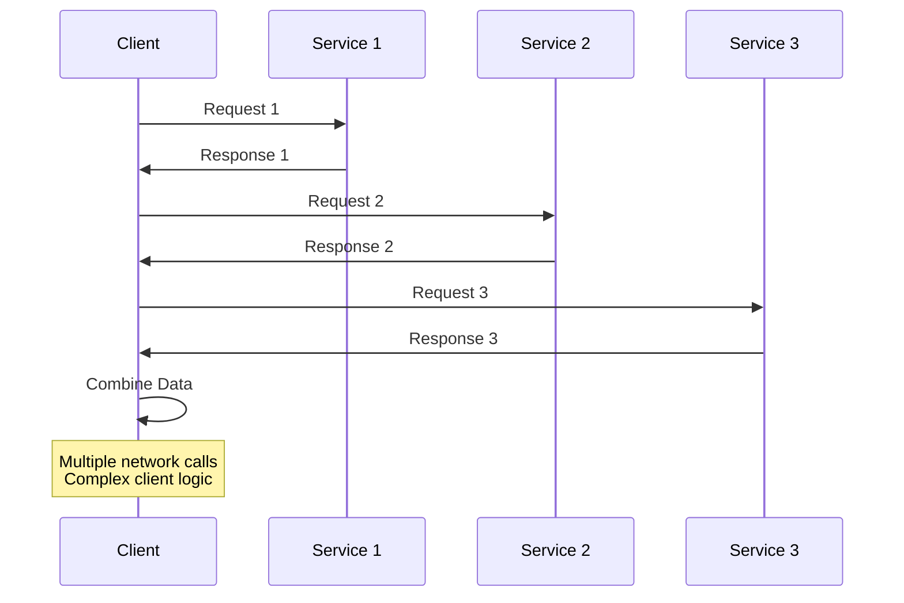
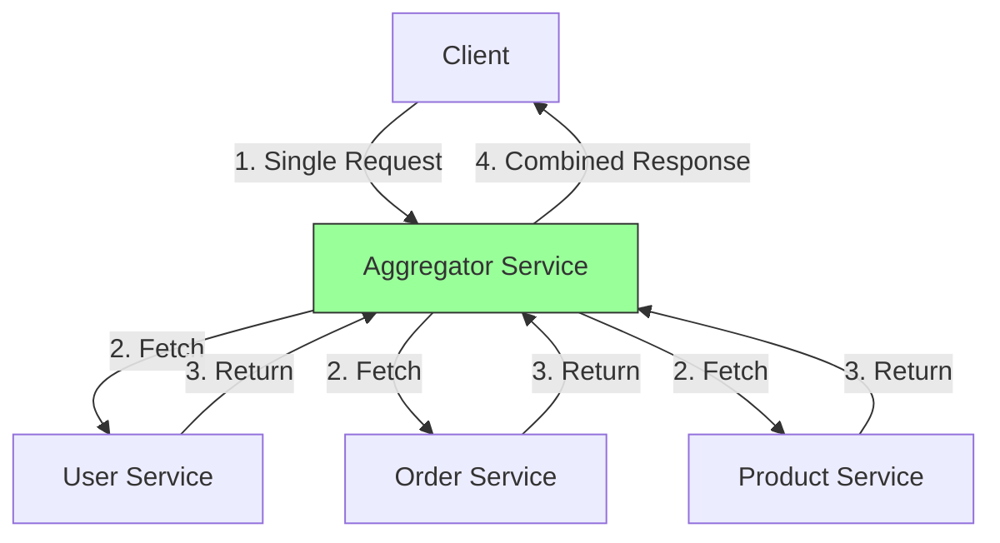

# Aggregator Pattern

A service that collects data from multiple microservices and combines them into a single response for the client.

## The Problem

Client needs data from multiple services:

**Challenges**:

- Multiple network calls from client
- Client must handle failures separately
- Complex logic in client code
- Slow performance (sequential calls)

## What is Aggregator Pattern?

A single service that fetches data from multiple services and returns combined result:

**Key Idea**: Client makes one call, aggregator handles complexity.

## How It Works

## What Aggregator Does

- **Combines**: Merges data from multiple services
- **Transforms**: Filters and formats data as needed
- **Joins**: Links related data together

## Benefits

- **Fewer Network Calls**: Client makes one request instead of many
- **Parallel Processing**: Aggregator fetches data concurrently
- **Simpler Client**: No complex aggregation logic in client
- **Better Performance**: Faster than sequential calls
- **Centralized Logic**: Aggregation logic in one place

## Challenges

- **Single Point of Failure**: Aggregator becomes critical
- **Increased Latency**: Slowest service determines response time
- **Tight Coupling**: Aggregator depends on multiple services
- **Error Handling**: Must handle failures from multiple services
