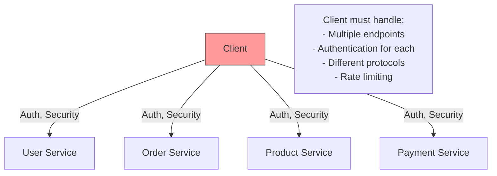
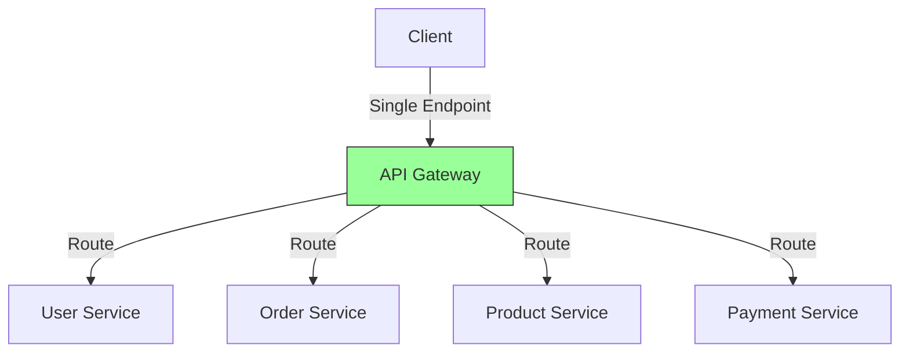

# API Gateway

A single entry point for all client requests that handles routing, authentication, rate limiting, and other cross-cutting concerns.

## The Problem

Clients directly calling multiple microservices creates complexity:

**Challenges**:

- Client knows about all services
- Authentication logic duplicated across services
- Hard to apply consistent policies
- Difficult to monitor and log requests
- Complex client code

## What is API Gateway?

Single entry point that routes requests to appropriate microservices:

**Key Idea**: Client calls one endpoint, gateway handles all complexity.

## What Gateway Does

- **Routes**: Directs requests to correct service
- **Authenticates**: Validates user identity
- **Rate Limits**: Prevents API abuse
- **Transforms**: Adapts requests/responses
- **Aggregates**: Combines multiple service calls
- **Logs**: Monitors all traffic
- **Caches**: Stores frequent responses

## Benefits

- **Simplified Client**: One endpoint to call
- **Centralized Security**: Authentication in one place
- **Consistent Policies**: Same rules for all services
- **Easy Monitoring**: Single point to track requests
- **Protocol Translation**: Convert between formats
- **Reduced Latency**: Can cache responses
