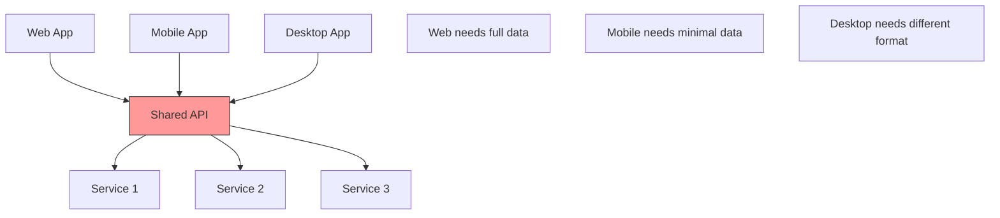
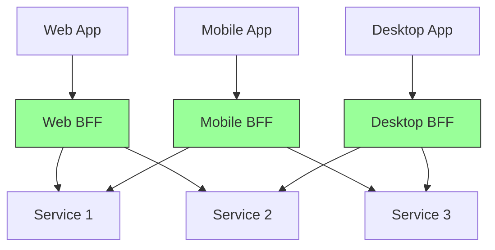
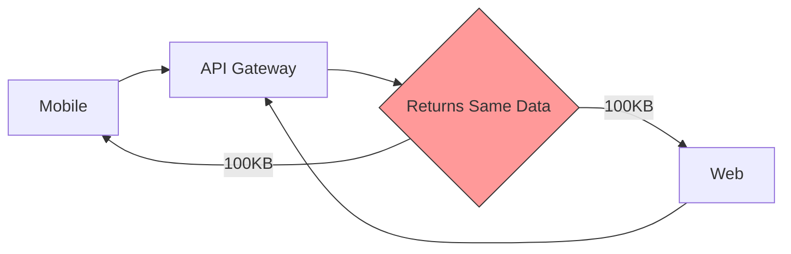
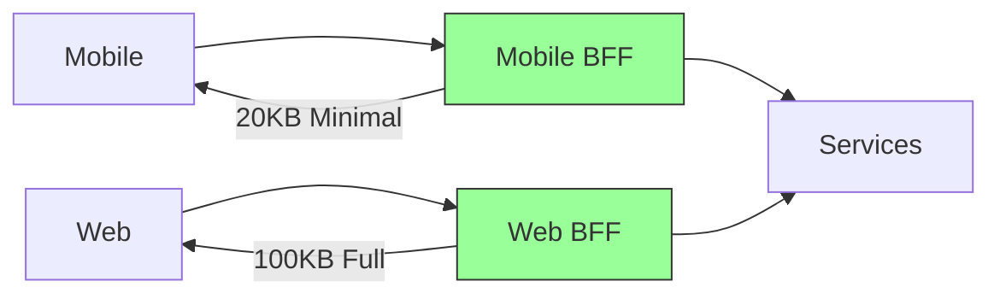
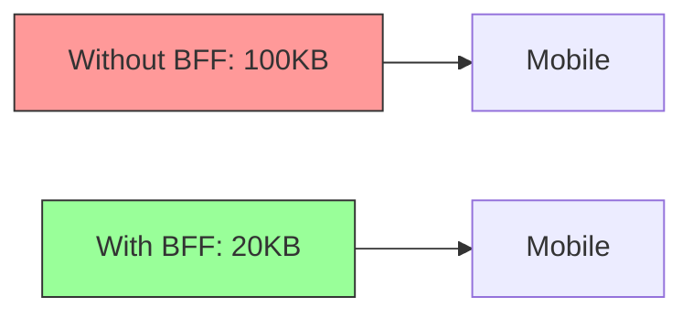
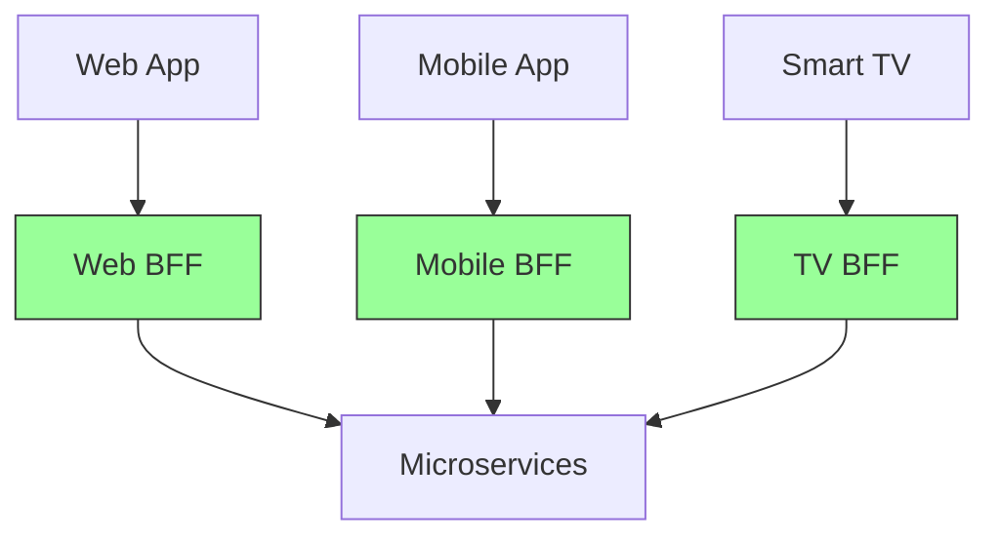
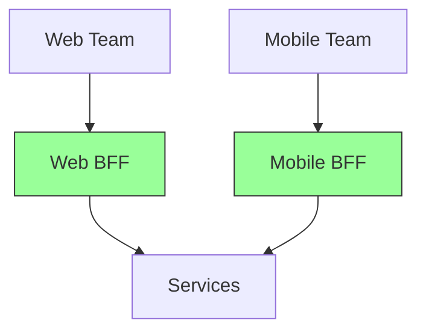
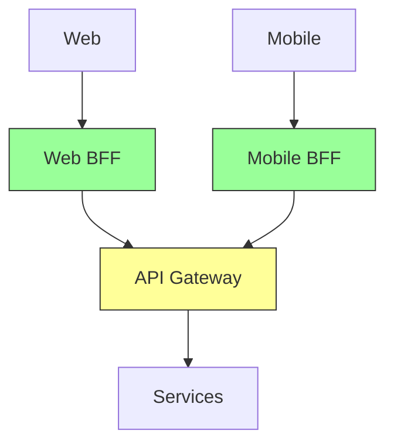

# Backend for Frontend (BFF)

A dedicated backend service tailored specifically for each frontend application (web, mobile, desktop), optimizing API responses for each client's needs.

## The Problem

Different frontends have different needs, but share the same API:



**Challenges**:

- Mobile needs minimal data (bandwidth constraints)
- Web needs rich data (large screen)
- Desktop needs different formats
- One API tries to serve all, becoming complex
- Slow performance due to unnecessary data

## What is BFF?

Create separate backend services for each frontend:



**Key Idea**: Each frontend gets exactly what it needs, nothing more, nothing less.

## Example: E-commerce Dashboard

### Without BFF

All clients use same API:



**Problems**:

- Mobile gets too much data
- Multiple API calls needed
- Complex client-side logic

### With BFF

Each client has tailored API:



**Benefits**:

- Mobile gets lightweight response
- Web gets rich response
- One call instead of many

## Key Benefits

### 1. Optimized for Each Client

**Mobile BFF** - Minimal data:
```json
{ "product": "Laptop", "price": 999, "image": "small.jpg" }
```

**Web BFF** - Rich data:
```json
{ "product": "Laptop", "price": 999, "images": [...], "reviews": [...] }
```

### 2. Less Network Traffic



### 3. Simpler Frontend

- **Without BFF**: Frontend makes multiple calls, handles complex logic
- **With BFF**: One simple call, BFF handles complexity

## Implementation Patterns

### Pattern 1: One BFF per Client Type



**Best For**: Different platforms with distinct needs

### Pattern 2: One BFF per Team



**Best For**: Independent teams managing their own stack

### Pattern 3: Hybrid Approach



**Best For**: BFF for transformation, Gateway for routing

## When to Use

✅ **Good Fit**:

- Multiple frontend platforms (web, mobile, desktop)
- Different data needs per platform
- Mobile performance is critical
- Teams own end-to-end (frontend + BFF)
- Need to iterate quickly on UI

❌ **Not Needed**:

- Single frontend application
- All clients need same data
- Simple API requirements
- Small team managing everything
- APIs already optimized
