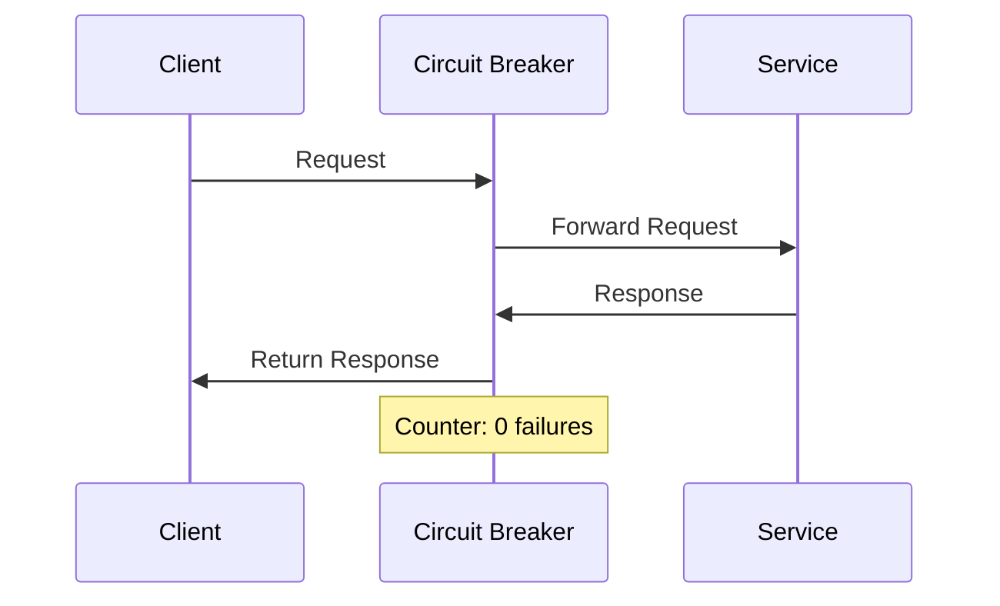
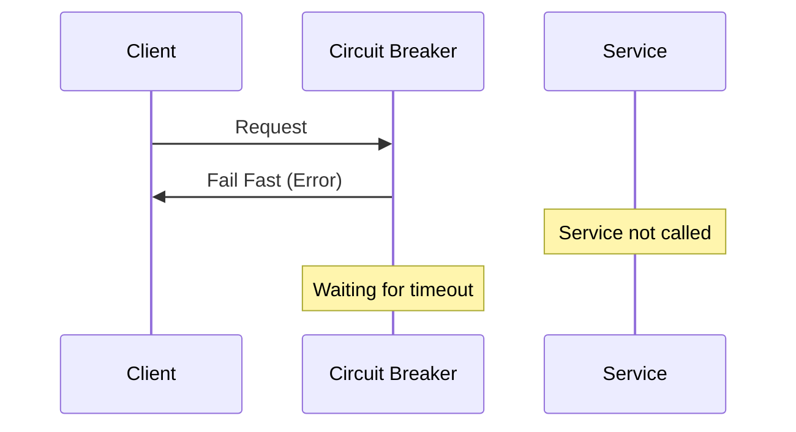
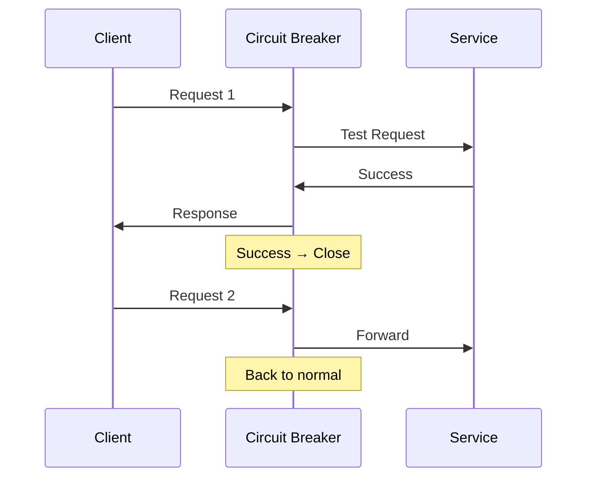
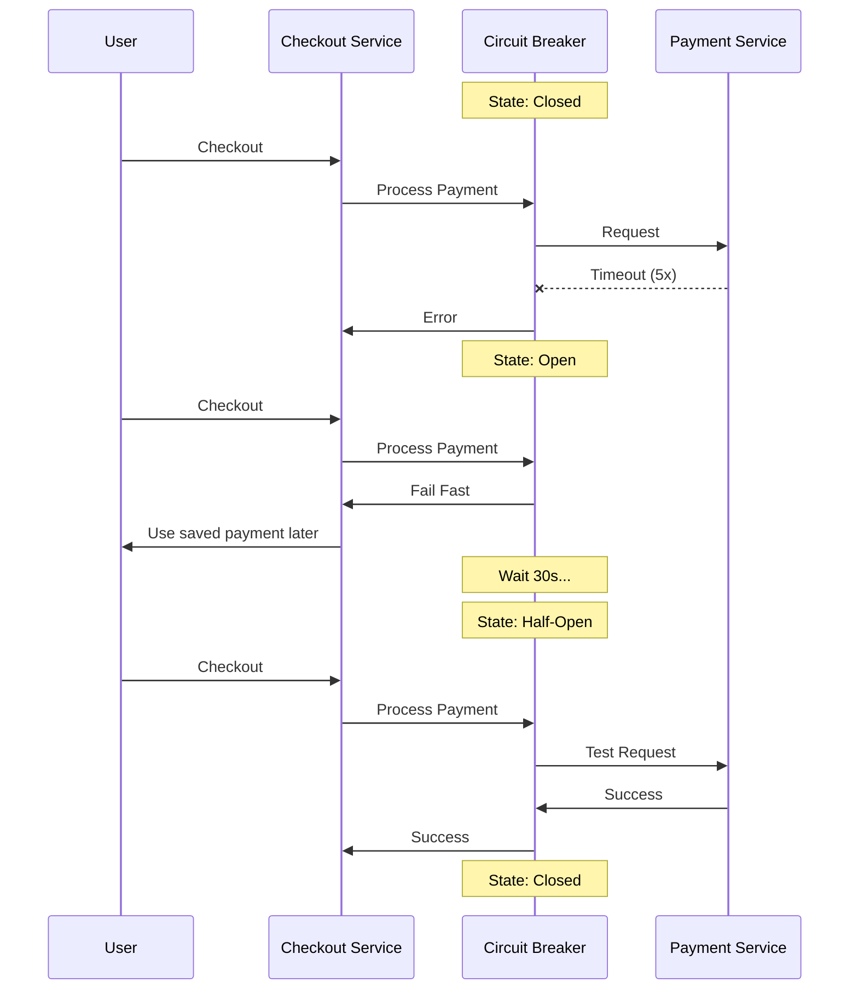

# Circuit Breaker Pattern

A resilience pattern that prevents cascading failures by stopping requests to a failing service and allowing it time to recover.

## The Problem

When a service fails, continuous retries can:

- Waste resources on requests that will fail
- Overload the failing service, preventing recovery
- Create cascading failures across dependent services
- Increase response times for users

**How It Works?**

Like an electrical circuit breaker, it monitors failures and "trips" to prevent further damage.

## Circuit States

### Closed (Normal)

- Requests flow normally to the service
- Counts failures and successes
- Moves to **Open** when failure threshold is reached

**Example**: Allow requests until 5 failures in 10 seconds

### Open (Blocking)

- Immediately rejects all requests without calling service
- Returns error or fallback response
- Moves to **Half-Open** after timeout period

**Example**: Wait 30 seconds before retrying

### Half-Open (Testing)

- Allows limited requests to test if service recovered
- **Success** → Back to Closed state
- **Failure** → Back to Open state

**Example**: Allow 3 test requests

## Real-World Example

E-commerce checkout calling payment service:

## Configuration Parameters

| Parameter             | Description                                   | Example               |
| --------------------- | --------------------------------------------- | --------------------- |
| **Failure Threshold** | Number/percentage of failures to open circuit | 5 failures or 50%     |
| **Timeout**           | How long to wait in Open state                | 30 seconds            |
| **Success Threshold** | Successes needed in Half-Open to close        | 3 successful requests |
| **Time Window**       | Period to measure failures                    | Last 10 seconds       |

## Benefits

- **Prevents Cascading Failures**: Stops failure from spreading
- **Fast Failure**: No waiting for timeouts
- **Automatic Recovery**: Self-healing when service recovers
- **Resource Protection**: Saves CPU, memory, connections
- **Better User Experience**: Quick fallback responses
