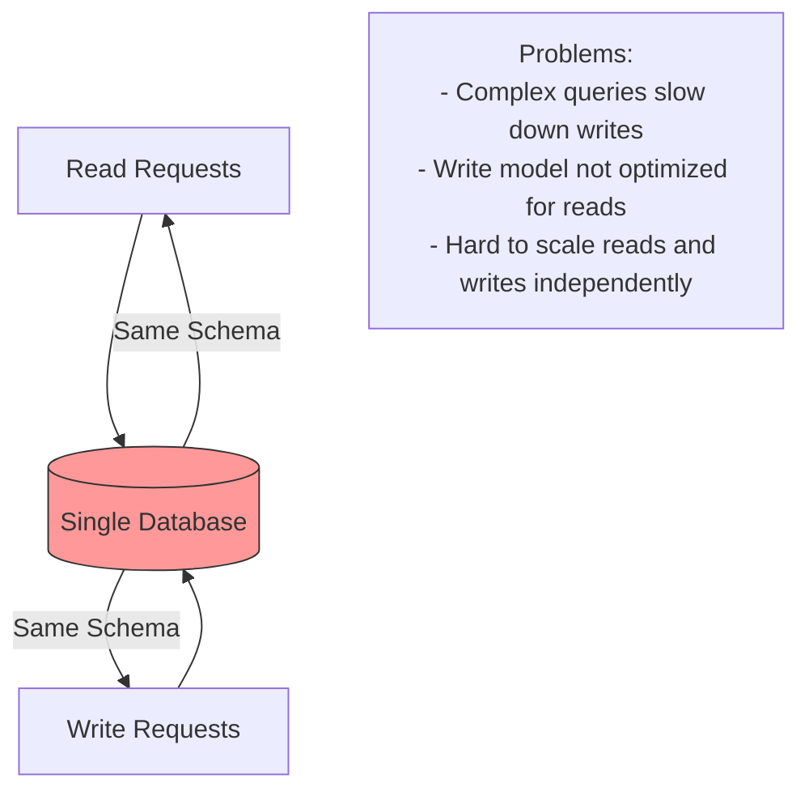
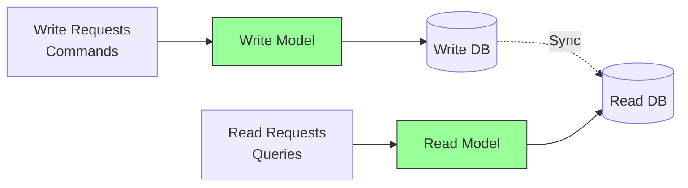
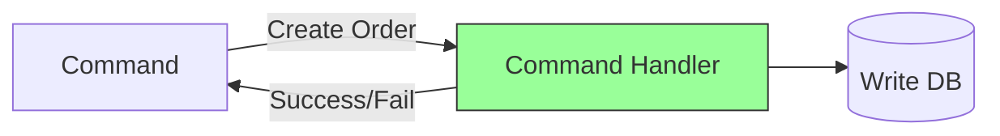
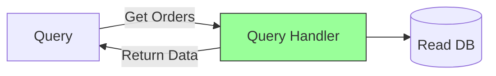

# CQRS

Command Query Responsibility Segregation - Separate models for reading and writing data.

## The Problem

Traditional systems use the same model for reads and writes:

**Challenges**:

- Same database handles both reads and writes
- Complex read queries impact write performance
- Cannot optimize for different access patterns
- Difficult to scale independently

## What is CQRS?

Separate the read model from the write model:

**Key Idea**: Commands change data, queries retrieve data - use separate models for each.

## Core Concepts

### Commands

Change the system state:

- **Creates/Updates/Deletes** data
- **Returns**: Success or failure (not data)
- **Examples**: CreateOrder, UpdateUser, DeleteProduct

### Queries

Read data without changing state:

- **Reads** data only
- **Returns**: Requested data
- **Examples**: GetOrderById, GetUserList, SearchProducts

## Benefits

- **Optimized Models**: Write model for updates, read model for queries
- **Independent Scaling**: Scale reads and writes separately
- **Better Performance**: Optimized databases for each operation
- **Flexibility**: Different storage technologies for reads and writes
- **Simpler Queries**: Read model tailored for specific views

## Challenges

- **Complexity**: Two models to maintain
- **Eventual Consistency**: Read model may lag behind write model
- **Data Synchronization**: Need mechanism to sync data
- **More Infrastructure**: Multiple databases to manage
