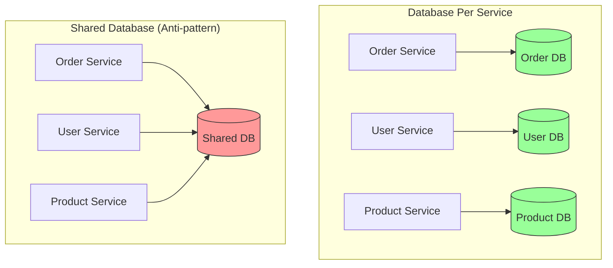
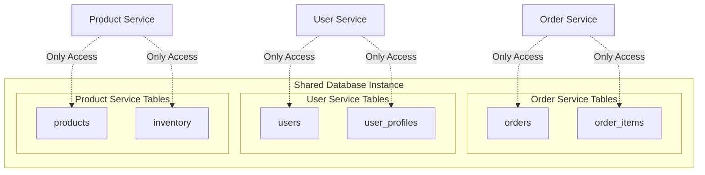
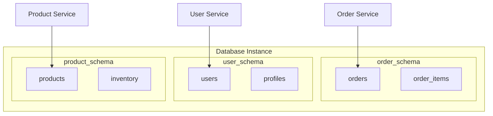
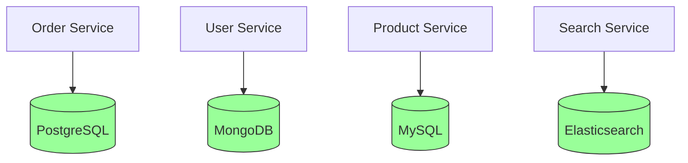
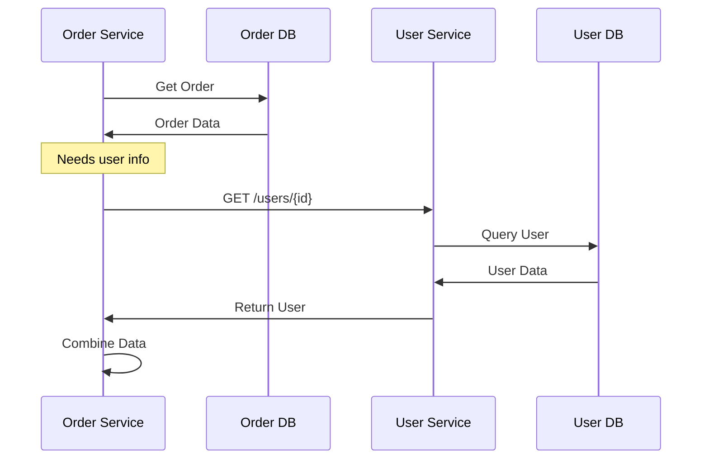

# Database Per Service

Each microservice owns its database. This isolation allows services to be developed, deployed, and scaled independently.

## The Concept

## Why Database Per Service?

- **Independence**: Services don't break when others change their schema
- **Technology Choice**: Use the best database for each service's needs
- **Scalability**: Scale databases based on individual service requirements
- **Fault Isolation**: Database failure affects only one service
- **Clear Ownership**: One team owns service and its data

## Implementation Approaches

### 1. Private Tables Per Service

Each service owns specific tables in a shared database instance:

**Pros**:

- Simple to set up
- Cost-effective

**Cons**:

- Temptation to access other tables
- Shared database resources
- Cannot use different database types

### 2. Schema Per Service

Each service has its own schema in a shared database instance:

**Pros**:

- Better logical separation
- Access control via schema permissions
- Easier backup/restore per service

**Cons**:

- Still shares database resources
- Limited technology choice

### 3. Database Server Per Service

Each service has its own database server:

**Pros**:

- Complete isolation
- Choose best database for each service
- Independent scaling
- True service autonomy

**Cons**:

- Higher operational complexity
- More infrastructure costs
- Need expertise in multiple databases

## Data Access Pattern

Services communicate via APIs, not direct database access:

**Key Rule**: Never access another service's database directly.

## Challenges and Solutions

### 1. Distributed Transactions

**Problem**: Cannot use ACID transactions across multiple databases.

**Solution**: Use Saga Pattern - break into steps with undo actions:

### 2. Data Duplication

**Problem**: Services need copies of data from other services.

**Solution**: Use events to sync data when it changes:

### 3. Cross-Service Queries

**Problem**: Cannot JOIN data across databases.

**Solution - Option 1**: Call APIs to combine data:

**Solution - Option 2**: Build a read-only database (CQRS):

## When to Use

✅ **Good Fit**:

- True microservices architecture
- Services with different data requirements
- Need for independent scaling
- Multiple teams working in parallel

❌ **Not Ideal**:

- Small applications
- Highly interconnected data
- Need for complex queries across entities
- Limited operational expertise
