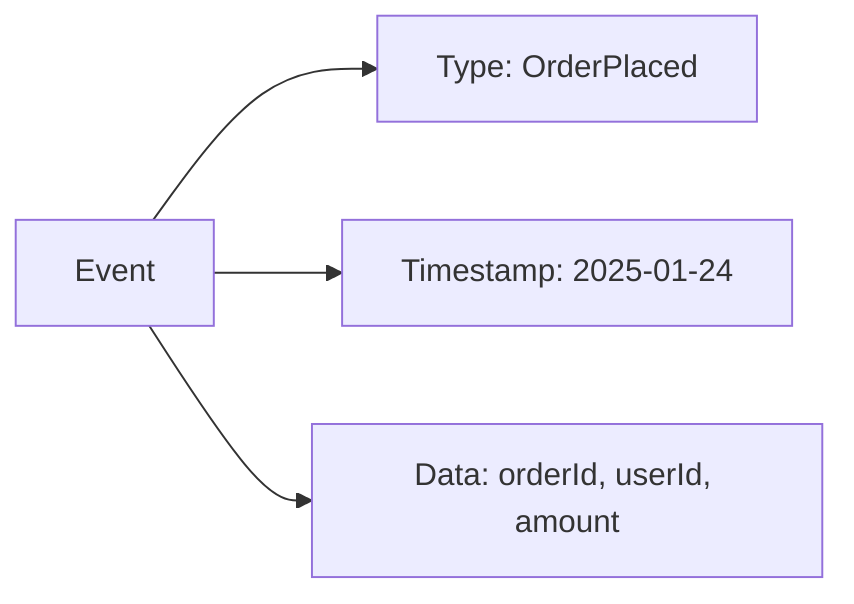
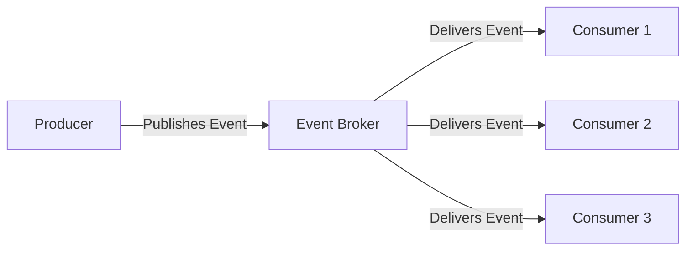
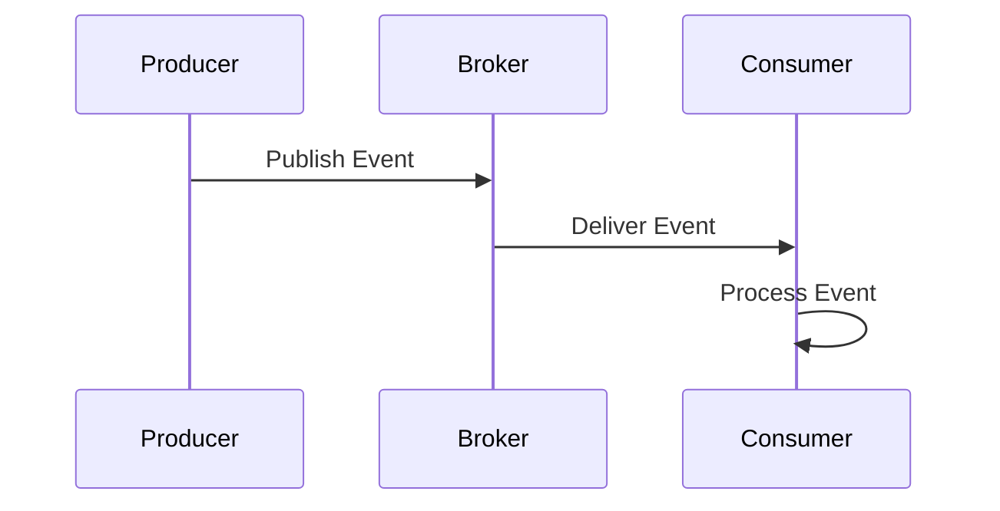
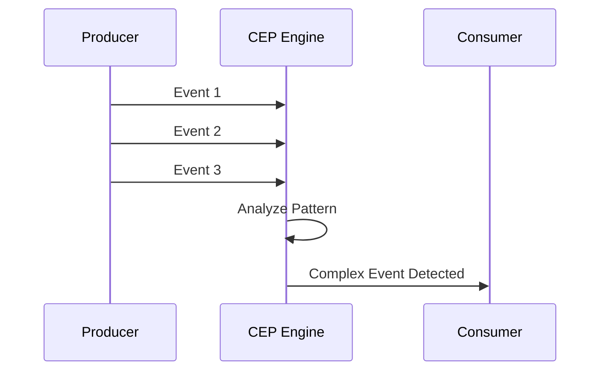
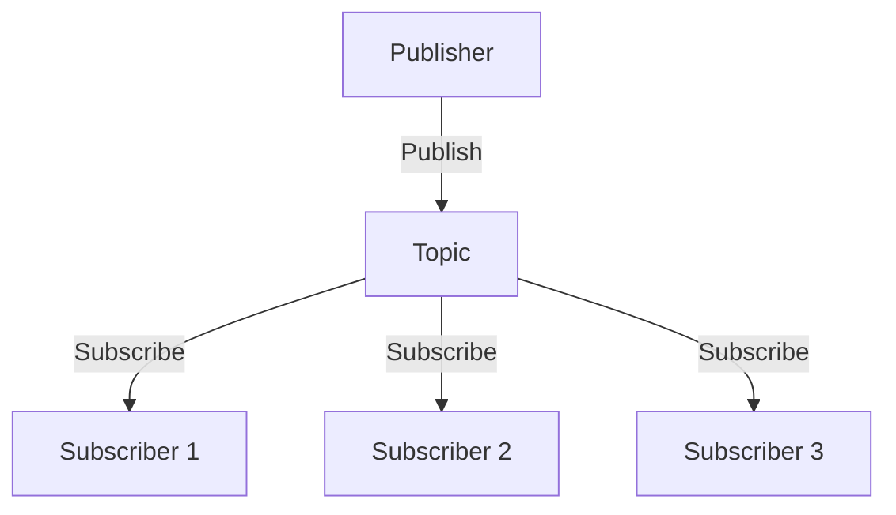
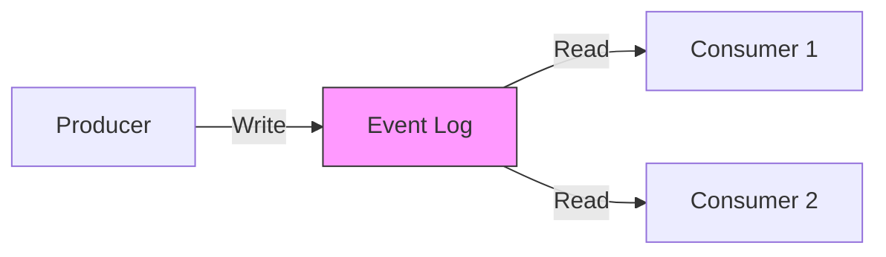
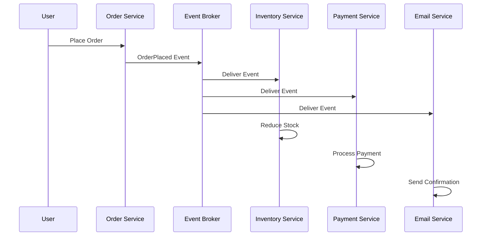

# Event Driven Architecture

A software design pattern where services communicate through events - notifications of state changes or actions that have occurred in the system.

## What is an Event?

An event represents something that has happened in the system. It contains:
- **Event Type**: What happened (e.g., "OrderPlaced", "UserRegistered")
- **Timestamp**: When it happened
- **Data**: Relevant information about the event

## Why Event Driven Architecture?

- **Loose Coupling**: Services don't need to know about each other
- **Scalability**: Add consumers without modifying producers
- **Real-time Processing**: React to changes as they happen
- **Resilience**: Services can operate independently
- **Audit Trail**: Events provide a natural history log

## Components

### Producer

Generates and publishes events when something happens in the system.

**Example**: Order service publishes "OrderPlaced" event when a customer completes checkout.

### Event Broker

Routes events from producers to interested consumers. Acts as the middleman.

**Examples**: Kafka, RabbitMQ, AWS SNS/SQS

### Consumer

Subscribes to and processes events. Multiple consumers can listen to the same event.

**Example**: Inventory service reduces stock, email service sends confirmation, analytics service logs data.

## Event Processing Patterns

### Simple Event Processing

Each event triggers a direct action immediately.

**Use Case**: Send email notification when user registers.

### Complex Event Processing

Analyzes patterns across multiple events to detect meaningful situations.

**Use Case**: Detect fraud when user makes 5+ purchases in 1 minute from different locations.

## Communication Models

### Pub-Sub (Publish-Subscribe)

- Publishers don't know who consumes events
- Subscribers receive all events from topics they subscribe to
- One-to-many relationship

### Event Stream

- Events stored in an ordered, immutable log
- Consumers read at their own pace
- Events can be replayed

## Real-World Example

## Challenges

| Challenge | Solution |
|-----------|----------|
| **Event Ordering** | Use partition keys or sequence numbers |
| **Duplicate Events** | Implement idempotent consumers |
| **Event Schema Changes** | Use schema registry and versioning |
| **Debugging Complexity** | Implement correlation IDs and distributed tracing |
| **Eventual Consistency** | Design UI for async workflows |

## Popular Tools

| Tool | Type | Best For |
|------|------|----------|
| **Apache Kafka** | Event Streaming | High-throughput, event replay |
| **RabbitMQ** | Message Broker | Traditional messaging patterns |
| **AWS SNS/SQS** | Cloud Service | AWS ecosystems |
| **Google Pub/Sub** | Cloud Service | GCP ecosystems |
| **Redis Streams** | In-Memory | Low-latency, simple use cases |
| **Apache Pulsar** | Event Streaming | Multi-tenancy, geo-replication |

## When to Use

✅ **Good Fit**:
- Microservices architecture
- Real-time data processing
- Systems requiring high scalability
- Need for audit logs

❌ **Not Ideal**:
- Simple CRUD applications
- Strong consistency requirements
- Tight latency constraints for all operations
