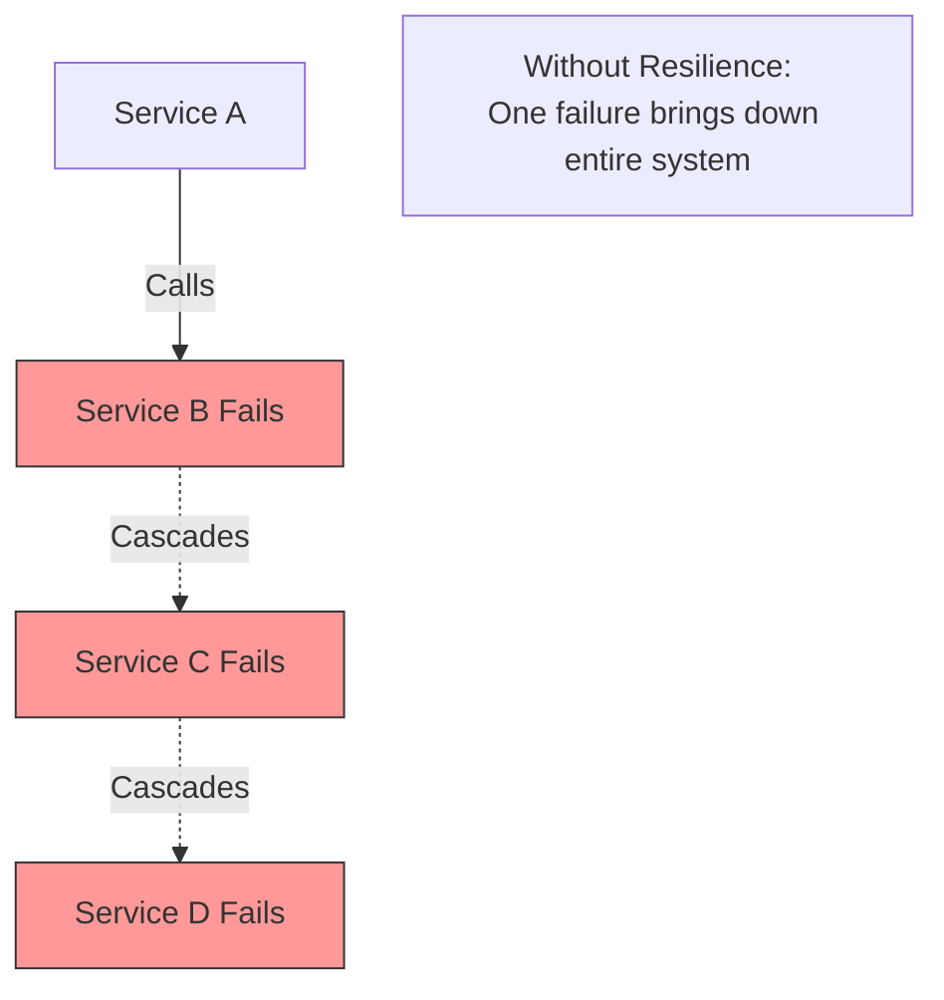
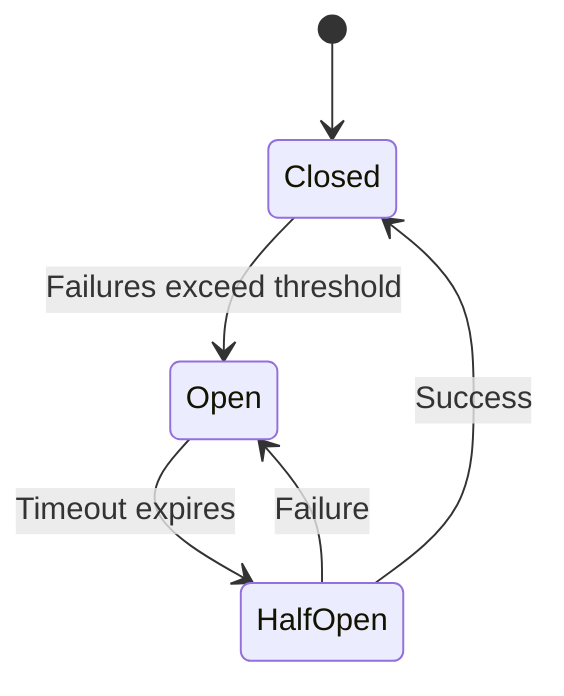

# Resilience Patterns

Patterns that help microservices handle failures gracefully and maintain system stability.

## Why Resilience matters?

Ability of a system to bounce back from failures and continue operating, even under pressure.

**In Microservices**:
- Services depend on each other
- One failure can cascade to others
- Network calls can fail or timeout
- Need to prevent system-wide outages

## Common challenges in Microservices

- **Network Failures**: Services cannot reach each other
- **Slow Responses**: Service delays cause timeouts
- **Cascading Failures**: One failure spreads to others
- **Resource Exhaustion**: Too many requests overwhelm services
- **Partial Outages**: Some instances fail while others work

## Resilience Patterns

### Circuit Breaker Pattern

Stops calling a failing service to give it time to recover.

**States**:
- **Closed**: Normal operation, requests pass through
- **Open**: Fail fast, no requests sent to service
- **Half-Open**: Test if service recovered with limited requests

**When to use**: Service frequently fails or becomes slow

### Retry Pattern

Automatically retry failed requests with delays between attempts.

**Exponential Backoff**: Increase delay between retries exponentially (1s, 2s, 4s, 8s).

**When to use**: Temporary network glitches or transient failures

### Fallback Pattern

Provide alternative response when service fails.

**Fallback Options**:
- Return cached data
- Return default value
- Return degraded response
- Call backup service

**When to use**: Must provide response even when service fails

### Bulkhead Pattern

Isolate resources to prevent one failure from affecting others.

**Key Idea**: Separate thread pools or connection pools for different services.

**Benefits**:
- One slow service doesn't block others
- Failures are isolated
- Resource limits per service

**When to use**: Multiple services share same resources

### Timeout Pattern

Set maximum wait time for service responses.

**Benefits**:
- Don't wait forever
- Free up resources quickly
- Prevent thread exhaustion

**Best Practices**:
- Set realistic timeouts
- Different timeouts for different operations
- Fast operations: 1-2 seconds
- Slow operations: 10-30 seconds

**When to use**: Always set timeouts for network calls