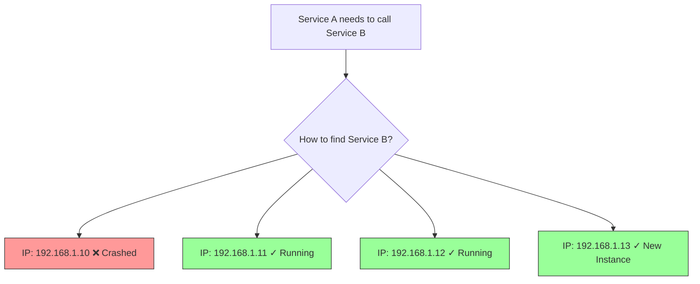
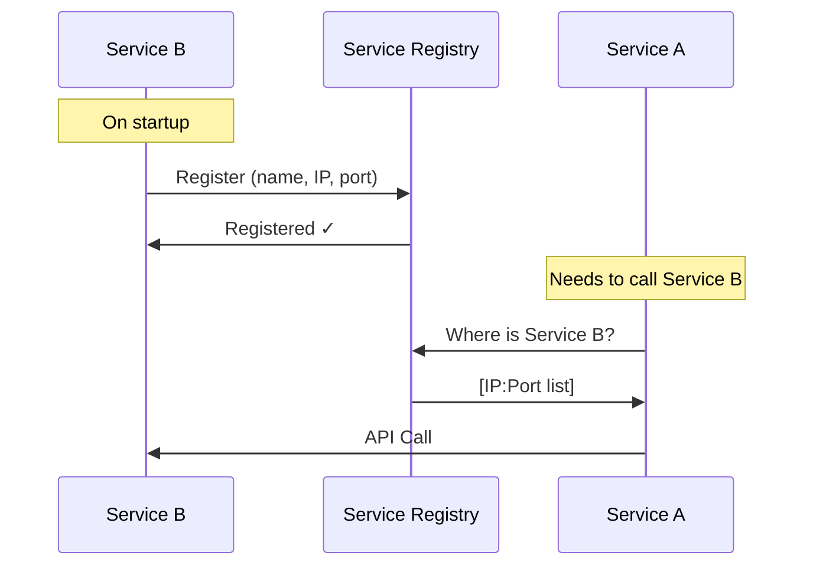
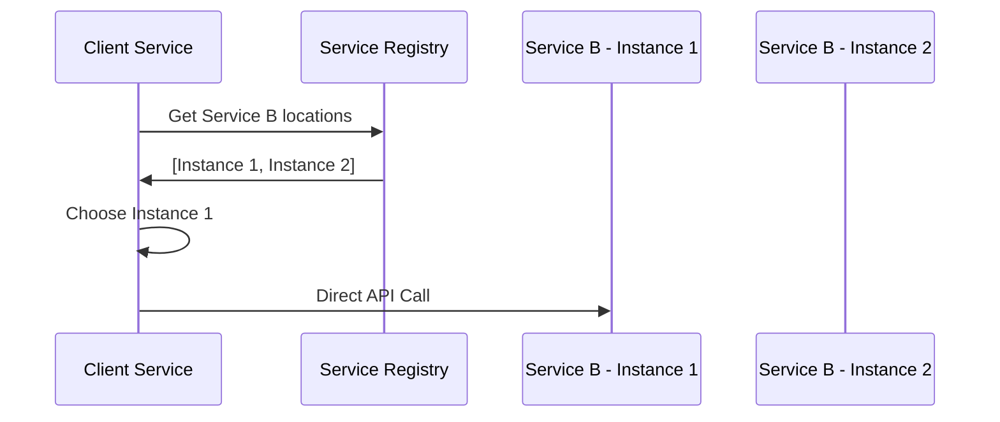
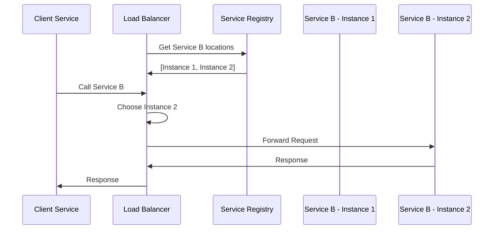
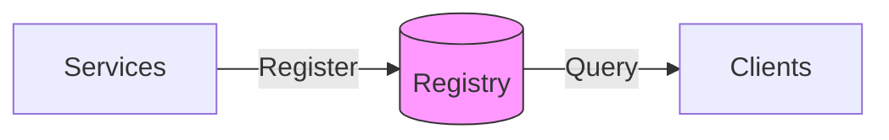
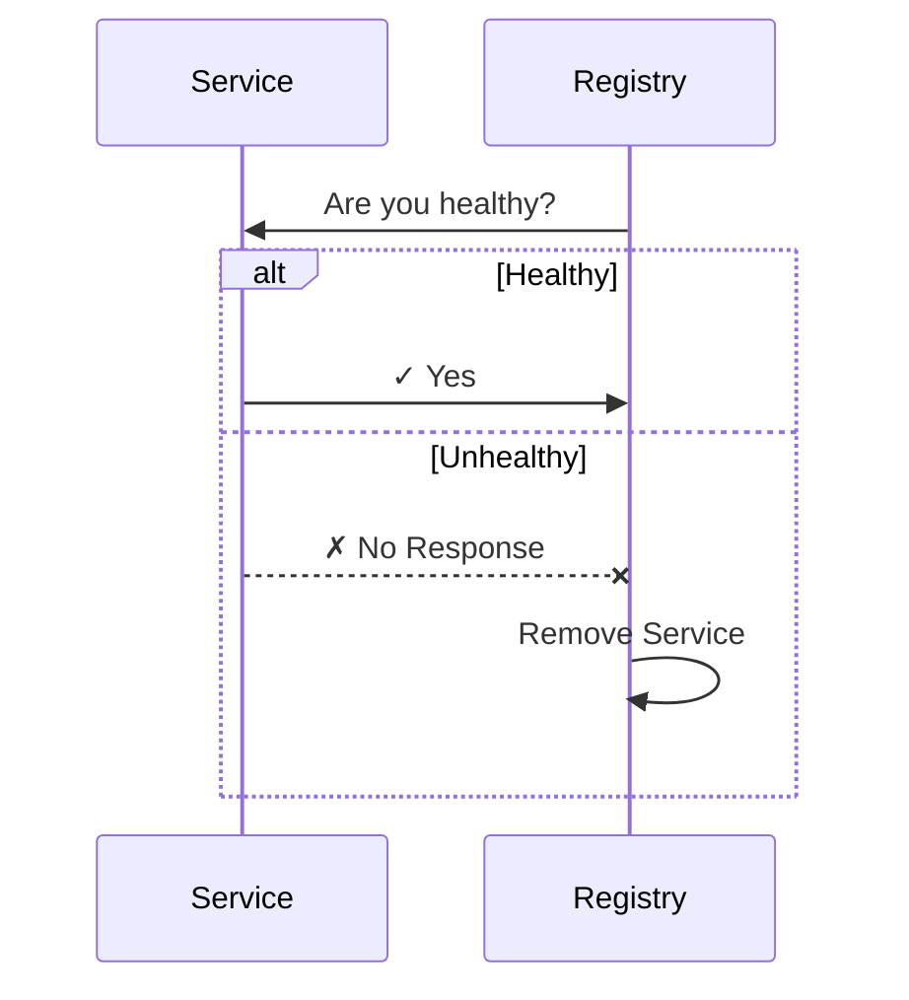

# Service Discovery

A mechanism that allows microservices to automatically locate and communicate with each other in a dynamic environment.

## The Problem

In microservices, service instances change frequently:

**Challenges**:

- Services scale up/down dynamically
- Instances crash and restart with new IPs
- Manual configuration doesn't work
- Hard-coded addresses break easily

## How It Works

Services register themselves in a central registry. Other services query the registry to find them.

## Service Discovery Patterns

### Client-Side Discovery

Client queries registry and chooses which instance to call:

**How it works**:

1. Client queries registry for service locations
2. Client gets list of available instances
3. Client picks an instance (load balancing logic in client)
4. Client calls the service directly

**Pros**:

- Client controls load balancing
- One less network hop
- Simple architecture

**Cons**:

- Client must implement discovery logic
- Load balancing code in every service
- Tight coupling to registry

**Tools**: Netflix Eureka, Consul

### Server-Side Discovery

Load balancer queries registry and routes requests:

**How it works**:

1. Client calls a well-known load balancer
2. Load balancer queries registry
3. Load balancer picks an instance
4. Load balancer forwards the request

**Pros**:

- Clients are simpler (no discovery logic)
- Centralized load balancing
- Easy to update routing rules

**Cons**:

- Extra network hop
- Load balancer is a single point of failure
- Additional infrastructure to manage

**Tools**: AWS ELB, Kubernetes Service, NGINX

## Key Components

### 1. Service Registry

Central database storing all service locations:

**Stores**: Service name, IP address, port, health status

### 2. Health Checks

Registry removes unhealthy services:

**Types**: HTTP endpoint, TCP port check, Heartbeat signals

### 3. Load Balancing

Distribute requests across instances:

- **Round Robin**: Instance 1 → 2 → 3 → 1
- **Random**: Pick any instance
- **Least Connections**: Pick instance with fewest active requests

## When to Use

✅ **Good Fit**:

- Microservices architecture
- Dynamic scaling (auto-scaling)
- Cloud environments
- Multiple service instances
- Frequent deployments

❌ **Not Needed**:

- Monolithic applications
- Static infrastructure
- Single instance per service
- Simple client-server apps
