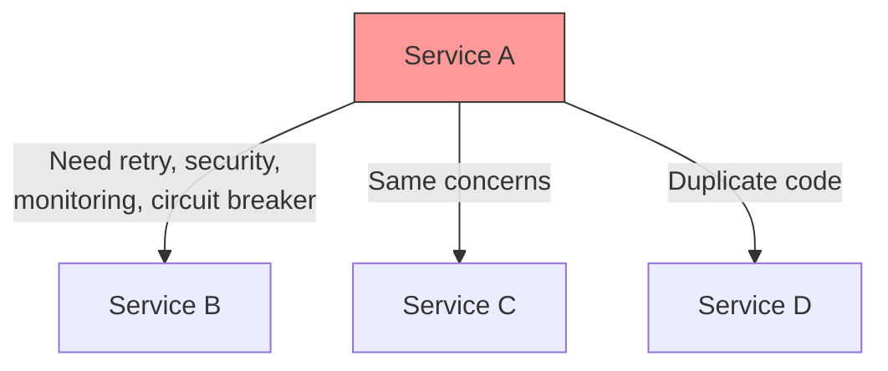
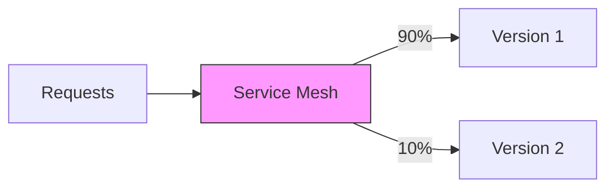
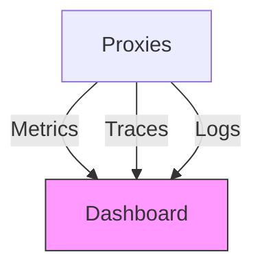
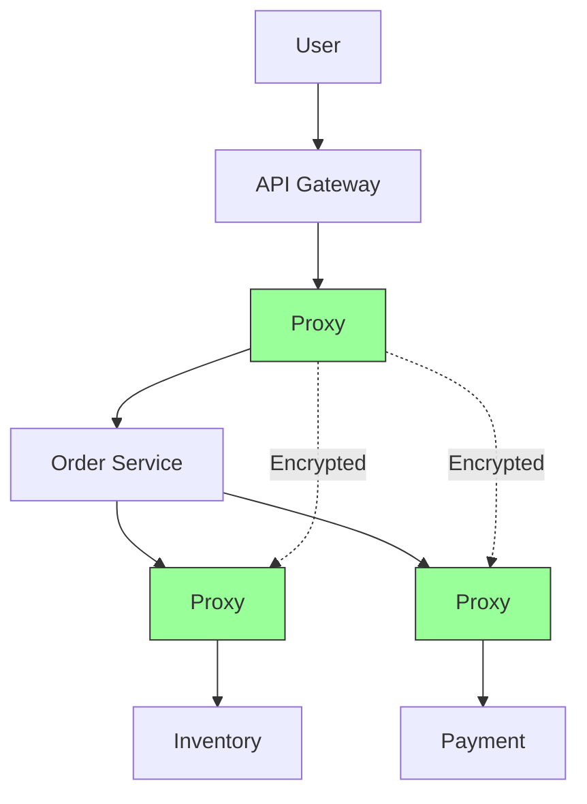

# Service Mesh

An infrastructure layer that handles service-to-service communication, providing security, monitoring, and traffic management without changing application code.

## The Problem

Each service needs to handle complex communication concerns:

**Challenges**:

- Code duplication across all services
- Hard to update policies consistently
- Different languages need different libraries

## What is a Service Mesh?

Proxies sit alongside each service and handle all communication:

**Key Idea**: Services focus on business logic. Proxies handle communication.

## Key Features

### 1. Traffic Management

Control how requests are distributed:

- Load balancing
- Canary deployments
- Circuit breaking
- Automatic retries

### 2. Security

Automatic encryption between services:

- Automatic certificate management
- Service-to-service authentication
- Authorization policies

### 3. Observability

Automatic monitoring and tracing:

- Request success/failure rates
- Latency tracking
- Service dependency maps

## Benefits

- **No code changes**: Add features without modifying services
- **Consistent policies**: Same rules for all services
- **Language agnostic**: Works with any language
- **Centralized control**: Manage everything from one place

## Challenges

- **Complexity**: Additional infrastructure to learn
- **Resource usage**: Each service needs a proxy
- **Performance**: Extra network hop
- **Debugging**: More components to troubleshoot

## When to Use

✅ **Good Fit**:

- Many microservices (10+)
- Multiple programming languages
- Need consistent security
- Complex traffic management

❌ **Not Needed**:

- Few services (< 5)
- Simple architecture
- Performance critical applications
- Small team without infrastructure expertise

## Real-World Example

E-commerce with service mesh:

**Benefits**:

- All calls encrypted automatically
- Auto-retry if payment is slow
- Circuit breaker if inventory fails
- Metrics show bottlenecks
