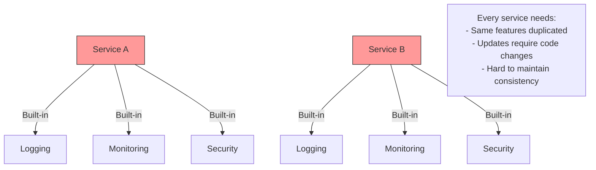
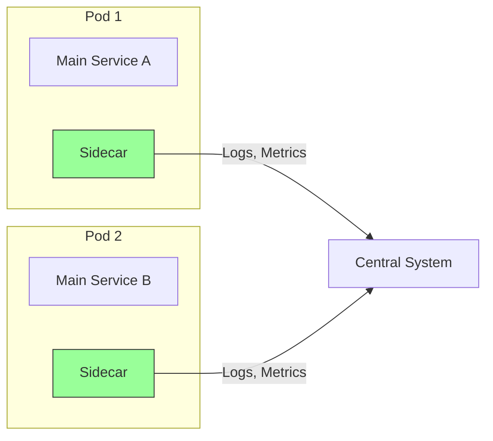

# Sidecar Pattern

A helper container deployed alongside the main application container to provide supporting features without changing the application code.

## The Problem

Applications need common features like logging, monitoring, security:

**Challenges**:

- Feature code duplicated across services
- Different languages need different implementations
- Updates require modifying every service
- Hard to maintain consistency

## What is Sidecar Pattern?

Deploy a helper container alongside each service to handle common features:

**Key Idea**: Sidecar handles cross-cutting concerns, main service focuses on business logic.

## What Sidecar Does

- **Logging**: Collects and forwards logs
- **Monitoring**: Gathers and sends metrics
- **Security**: Handles encryption, authentication
- **Configuration**: Manages config updates
- **Proxying**: Routes network traffic
- **Service Discovery**: Finds other services

## Benefits

- **No Code Changes**: Add features without modifying service
- **Language Agnostic**: Works with any programming language
- **Reusable**: Same sidecar across all services
- **Independent Updates**: Update sidecar without touching service
- **Separation of Concerns**: Service focuses on business logic

## Challenges

- **Resource Overhead**: Extra container per service
- **Complexity**: More components to manage
- **Latency**: Additional network hop
- **Deployment**: Need container orchestration (Kubernetes)

## When to Use

✅ **Good Fit**:

- Microservices in containers (Kubernetes)
- Need consistent cross-cutting features
- Multiple programming languages
- Want to avoid code duplication
- Need independent feature updates

❌ **Not Needed**:

- Monolithic applications
- Single service deployment
- No container orchestration
- Simple applications
- Resource constraints
