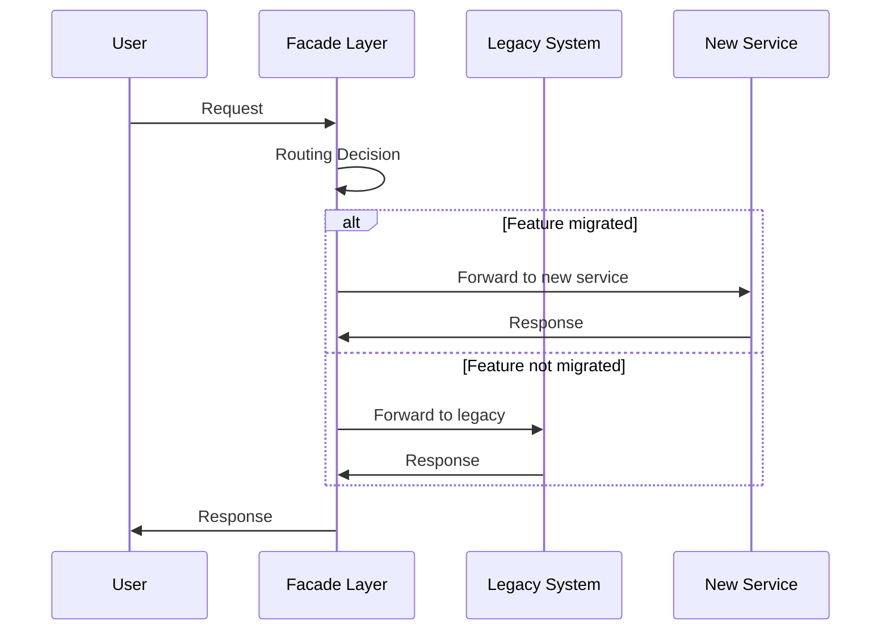
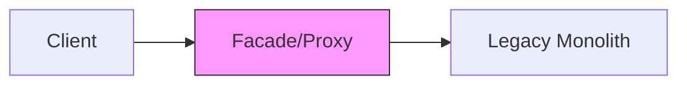
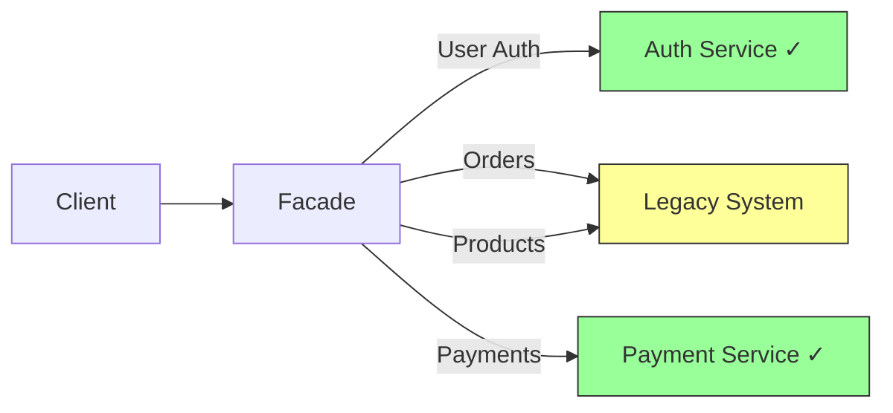
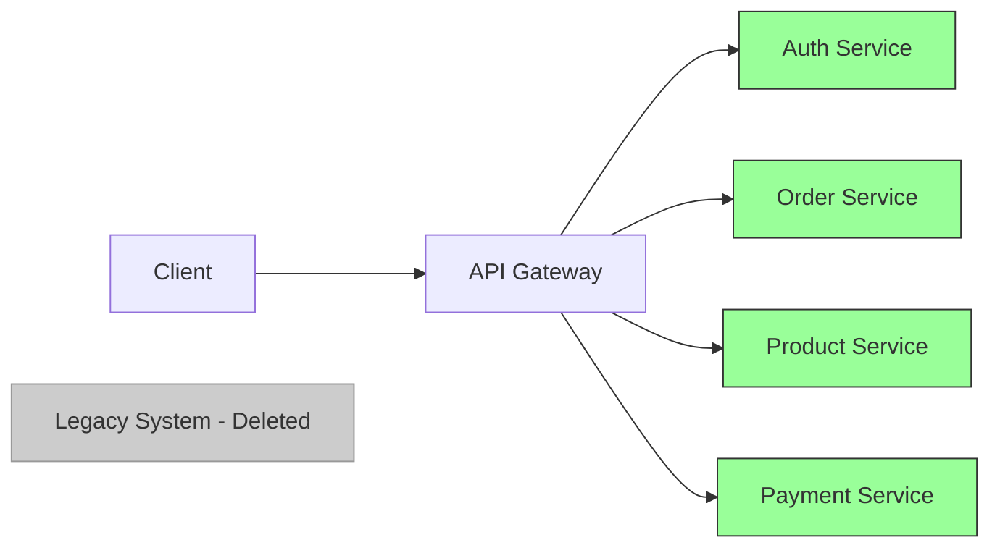
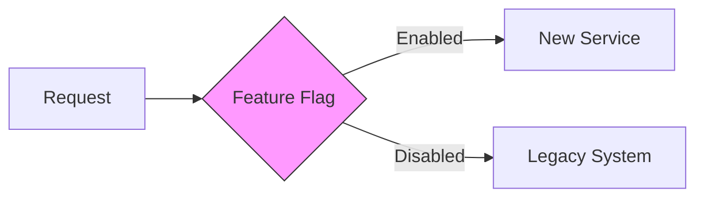

# Strangler Pattern

A migration strategy to gradually replace a legacy system with a new microservices architecture without causing disruption.

## The Concept

Named after strangler fig trees that grow around host trees and eventually replace them. Similarly, new services gradually "strangle" the old system until it can be retired.

## The Problem

Traditional "big bang" rewrites are risky:

- Long development cycles without business value
- High risk of failure
- Service disruption during cutover
- Difficult to roll back
- Business must wait months/years for benefits

## How It Works

### Three-Step Process

1. **Intercept**: Route traffic through a facade/proxy
2. **Migrate**: Gradually move features to new services
3. **Retire**: Remove old code as new services take over

## Migration Phases

### Phase 1: Setup Facade

Add a routing layer in front of the legacy system:

**Actions**:

- Deploy facade/API gateway
- Route all traffic through it
- No changes to legacy system yet

### Phase 2: Incremental Migration

Migrate features one at a time:

**Actions**:

- Build new service for one feature
- Update facade routing rules
- Test thoroughly
- Repeat for next feature

### Phase 3: Complete Replacement

All features migrated, retire legacy:

## Benefits

- **Low Risk**: Incremental changes, easy to rollback
- **Continuous Value**: Deliver new services as they're ready
- **No Downtime**: System runs throughout migration
- **Team Flexibility**: Multiple teams can work in parallel
- **Learn and Adapt**: Improve approach based on early migrations

## Tools and Techniques

### API Gateway Options

| Tool                | Use Case                      |
| ------------------- | ----------------------------- |
| **NGINX**           | Simple routing, reverse proxy |
| **Kong**            | Advanced routing, plugins     |
| **AWS API Gateway** | Cloud-native, managed service |
| **Envoy**           | Service mesh, complex routing |

### Feature Flags

Use feature flags to gradually roll out new services:

- A/B testing new implementation
- Canary deployments
- Quick rollback if issues arise

## When to Use

✅ **Good Fit**:

- Large legacy monoliths
- Active development on legacy system
- Cannot afford downtime
- Want to deliver value incrementally
- Team needs to learn microservices gradually

❌ **Not Ideal**:

- Small, simple applications
- Legacy system is barely used
- Can afford a complete rewrite
- Clear cutover date required
