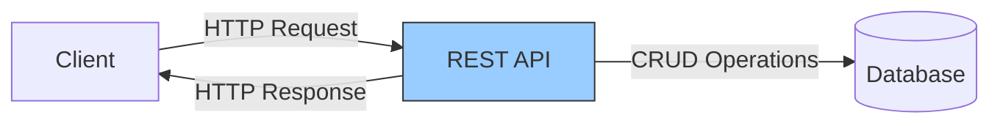
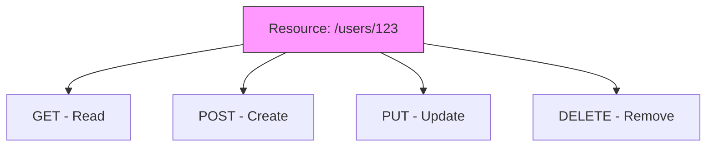
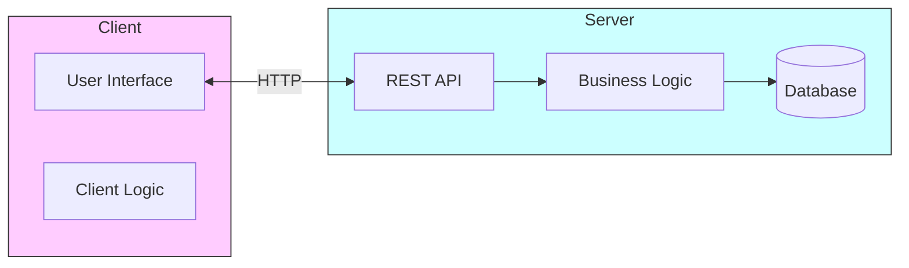
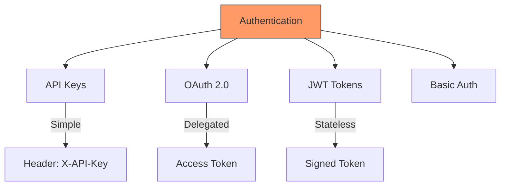

# REST API

REST (Representational State Transfer) is an architectural style for designing networked applications. It defines a set of constraints for how data is exchanged over the web using standard HTTP methods.

## What is REST?

REST API is a type of web API that follows client-server principles, focusing on delivering resources through stateless HTTP operations.



## Core Principles

### 1. Uniform Interface

Standardized way to interact with resources using HTTP methods.



**Benefits**:

- Consistent API design
- Easy to understand and use
- Predictable behavior

### 2. Stateless

Each request contains all information needed to process it. Server does not store client session state.

**Advantages**:

- Scalability: Any server can handle any request
- Reliability: No session data to lose
- Simplicity: No session management complexity

### 3. Client-Server Separation

Clear separation between client (UI) and server (data storage and business logic).



**Benefits**:

- Independent evolution
- Multiple clients can use same API
- Easier to scale separately

### 4. Cacheable

Responses indicate if they can be cached to improve performance.

**Cache Headers**:

- `Cache-Control`: max-age, no-cache
- `ETag`: Version identifier
- `Last-Modified`: Timestamp

## HTTP Methods

| Method | Purpose           | Idempotent | Safe |
| ------ | ----------------- | ---------- | ---- |
| GET    | Retrieve resource | ✓          | ✓    |
| POST   | Create resource   | ✗          | ✗    |
| PUT    | Update/Replace    | ✓          | ✗    |
| PATCH  | Partial update    | ✗          | ✗    |
| DELETE | Remove resource   | ✓          | ✗    |

**Idempotent**: Same result when called multiple times
**Safe**: Does not modify data

## Resource Naming

```
GET    /users              - List all users
GET    /users/123          - Get specific user
POST   /users              - Create new user
PUT    /users/123          - Update user
DELETE /users/123          - Delete user
GET    /users/123/orders   - Get user's orders
```

**Best Practices**:

- Use nouns, not verbs
- Use plural names
- Hierarchical structure
- Lowercase with hyphens

## Status Codes

| Code | Category     | Meaning               |
| ---- | ------------ | --------------------- |
| 2xx  | Success      | Request succeeded     |
| 3xx  | Redirection  | Further action needed |
| 4xx  | Client Error | Invalid request       |
| 5xx  | Server Error | Server failed         |

**Common Codes**:

- `200 OK` - Success
- `201 Created` - Resource created
- `400 Bad Request` - Invalid input
- `401 Unauthorized` - Authentication required
- `404 Not Found` - Resource doesn't exist
- `500 Internal Server Error` - Server error

## API Characteristics

### API Types Comparison

| Type    | Protocol  | Data Format | Use Case           |
| ------- | --------- | ----------- | ------------------ |
| REST    | HTTP      | JSON/XML    | Web services       |
| SOAP    | HTTP/SMTP | XML         | Enterprise systems |
| GraphQL | HTTP      | JSON        | Flexible queries   |
| gRPC    | HTTP/2    | Protobuf    | High performance   |

### Authentication Methods



**Security Levels**:

- **API Keys**: Simple, suitable for server-to-server
- **OAuth 2.0**: Delegated access, third-party apps
- **JWT**: Stateless, contains user claims
- **Basic Auth**: Username/password (use with HTTPS)

## Processing Methods

### Real-Time Processing

Immediate response to each request.

**Use Cases**:

- User login
- Search queries
- Single record updates

### Batch Processing

Process multiple operations together.

**Use Cases**:

- Bulk imports
- Report generation
- Data migrations
