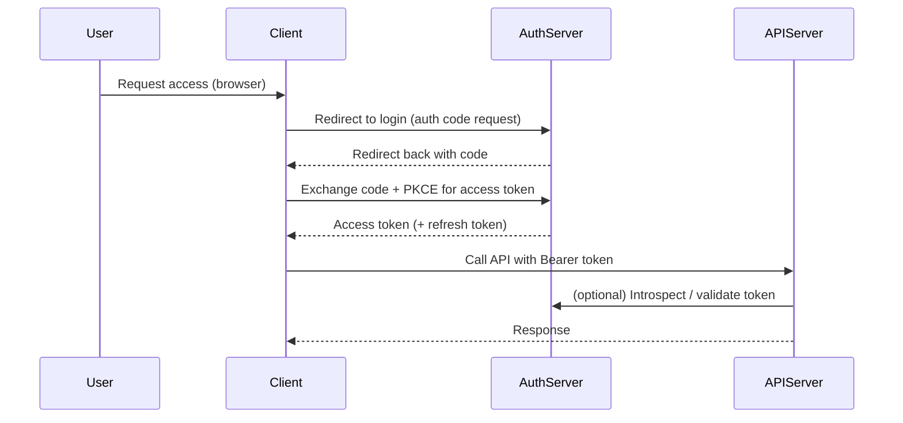
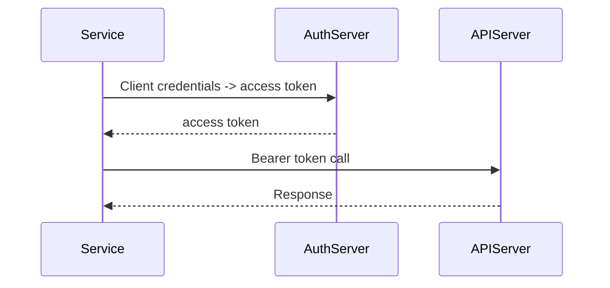

# API Authentication

Process of verifying the identity of callers (users, services, or devices) that access an API.

Proper API authentication ensures only legitimate clients can call your endpoints, and it supports access control, auditing, and abuse prevention.

- **Ensure security:** Stop unauthorized access
- **Control access by identity:** Apply least privilege and scopes
- **Monitor usage:** Link actions to identities for auditing
- **Protect resources:** Combine auth with rate limiting and quotas

## Authentication vs Authorization

- **Authentication**: Proving who you are (e.g., API key, JWT, OAuth token).
- **Authorization**: What you are allowed to do (e.g., scopes, roles, permissions).

Both are necessary: authenticate the caller, then authorize the requested action.

## Common API Authentication Methods

### HTTP Basic Authentication

Simple username:password sent in the `Authorization: Basic ...` header. Only acceptable over HTTPS for legacy/private APIs.

Example (curl):

```bash
curl -u user:password https://api.example.com/resource
```

Drawbacks: credentials sent on every request and limited flexibility.

### API Key Authentication

An opaque token (API key) presented in a header or query parameter. Common for server-to-server and third-party integrations.

Example (header):

```bash
curl -H "Authorization: ApiKey R4nd0mKey" https://api.example.com/resource
```

Best practices:

- Send keys in headers, never in URLs when possible
- Scope and rotate keys regularly
- Attach metadata (owner, creation date, last used)
- Rate limit and monitor per-key usage

### JWT (JSON Web Tokens)

JWTs are self-contained tokens that carry claims (iss, aud, sub, exp, scopes). They are signed (usually with RS256) so the server can validate without state.

Important validation checks:

- Verify signature (use JWKS for rotating keys)
- Validate `exp` (expiry) and `nbf` (not before)
- Validate `aud` (audience) and `iss` (issuer)
- Validate scopes/claims required for the endpoint

### OAuth 2.0

OAuth 2.0 is the de-facto standard for delegated authorization. For APIs you commonly see:

- **Authorization Code (with PKCE)** — for web & mobile apps where a user signs in
- **Client Credentials** — for server-to-server authentication
- **Refresh tokens** — to obtain new access tokens without interactive login

Mermaid: Authorization Code flow



Mermaid: Client Credentials flow



OAuth considerations:

- Use Authorization Code + PKCE for public clients (SPA, mobile)
- Use Client Credentials for backend services
- Keep access tokens short-lived and use refresh tokens safely
- Validate tokens using JWT verification or the token introspection endpoint
