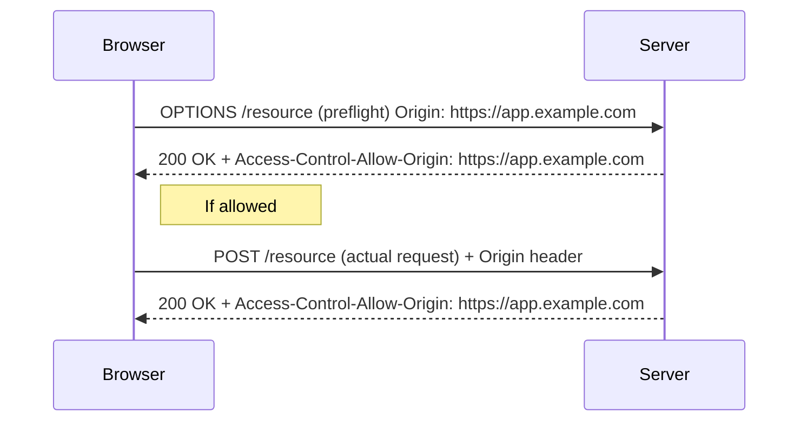

# CORS

Cross-Origin Resource Sharing (CORS) is a browser security feature that controls how resources on a web page can request assets (fonts, APIs, images, etc.) from a different origin (domain, protocol, or port).

Browsers implement the Same-Origin Policy (SOP) to prevent malicious sites from reading sensitive data from other origins. CORS provides a controlled way to relax SOP for trusted origins by using HTTP headers.

## Why CORS Exists

- **Same-Origin Policy (SOP)** blocks cross-origin reads by default to protect user data.
- **Web APIs and microservices** often live on different domains or ports; legitimate cross-origin requests must be allowed explicitly.
- **CORS** gives servers a safe mechanism to declare which origins, methods, and headers are allowed.

## How CORS Works (Overview)

- Client (browser) issues a request to a different origin.
- Server responds with CORS response headers indicating whether the request is allowed.
- For simple requests, the browser checks headers and allows or blocks access to the response.
- For non-simple (or unsafe) requests, the browser sends a preflight `OPTIONS` request to check permissions before sending the actual request.

## Important CORS Response Headers

- `Access-Control-Allow-Origin`: Specifies allowed origin(s) (e.g., `https://app.example.com` or `*`).
- `Access-Control-Allow-Methods`: Methods allowed for cross-origin requests (GET, POST, PUT, DELETE, etc.).
- `Access-Control-Allow-Headers`: Allowed request headers (e.g., `Content-Type`, `Authorization`).
- `Access-Control-Allow-Credentials`: `true` allows cookies and credentials; requires a specific origin (not `*`).
- `Access-Control-Max-Age`: Caches preflight response for given seconds.
- `Access-Control-Expose-Headers`: Allows browsers to access additional headers from the response.

## Security Considerations & Best Practices

- **Never** use `Access-Control-Allow-Origin: *` together with `Access-Control-Allow-Credentials: true`.
- Prefer allowing specific origins rather than `*`.
- Validate and sanitize input on the server — CORS is not an authorization control, only a browser-side access control.
- Use short `Access-Control-Max-Age` values for highly dynamic permission changes (or longer if stable and safe).
- Log preflight and CORS failures for debugging and security monitoring.
- Combine CORS with proper authentication (tokens, cookies with SameSite), authorization checks, and rate limiting.
- For APIs that must be public to everyone (public assets), consider static hosting or a CDN with proper headers.
