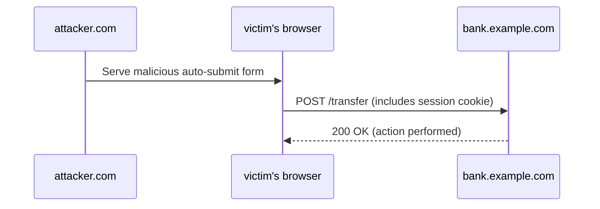

# CSRF Attacks

Cross-Site Request Forgery (CSRF) is an attack that tricks an authenticated user’s browser into making unwanted requests to a web application in which the user is authenticated. Because browsers automatically include credentials like cookies, a malicious page can cause the victim's browser to perform state-changing actions (transfer money, change email, etc.) without the user's intent.

## Why CSRF works

- Browsers automatically send cookies and some credentials with requests to the target origin.
- If an attacker can cause a victim's browser to issue a request (via a form, image, script, or fetch), that request will carry the victim's cookies — and may be treated as authenticated by the server.

## Example attack (HTML form auto-submit)

An attacker can host a page with a form that auto-submits to a vulnerable endpoint on `bank.example.com`:

```html
<!-- attacker.html hosted on attacker.com -->
<form id="f" action="https://bank.example.com/transfer" method="POST">
  <input type="hidden" name="to" value="attacker-account" />
  <input type="hidden" name="amount" value="1000" />
</form>
<script>
  document.getElementById("f").submit();
</script>
```

If the victim is logged into `bank.example.com` and has a valid session cookie, the browser sends that cookie with the request and the bank may process the transfer.



## Common CSRF Mitigations

1. CSRF Tokens (Synchronizer Token Pattern)

   - Server issues a cryptographically strong, unpredictable token per session (or per request) and embeds it in HTML forms and/or JavaScript responses.
   - The client must include the token on subsequent state-changing requests (header or hidden field). The server verifies the token matches the expected value for that session.
   - Tokens must be tied to the user session and cannot be guessable.

   Example (HTML form):

```html
<form method="POST" action="/transfer">
  <input type="hidden" name="_csrf" value="{{csrfToken}}" />
  <!-- fields -->
</form>
```
