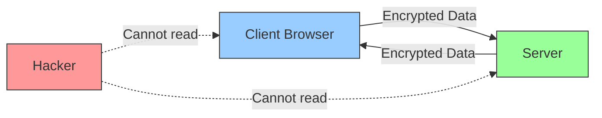
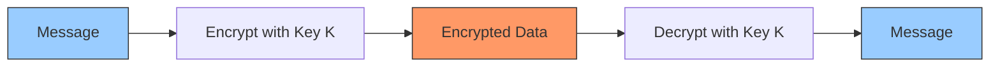
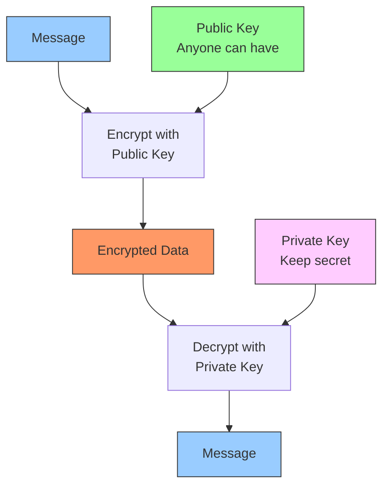
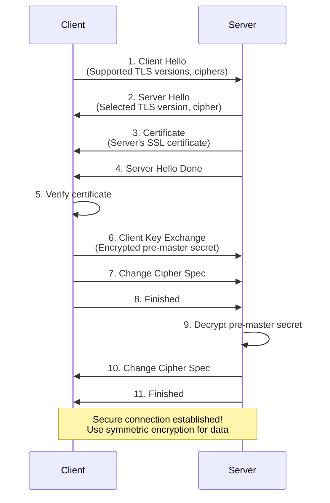
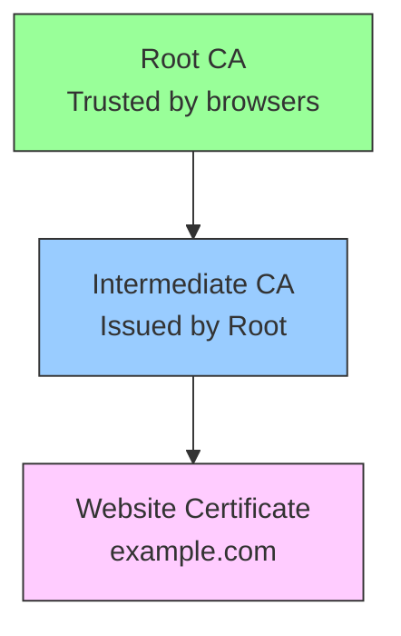

# HTTPS Security

HTTPS (Hypertext Transfer Protocol Secure) is the secure version of HTTP. It encrypts data between your browser and the server, protecting against eavesdropping and tampering.

## What is HTTPS?

HTTPS = HTTP + TLS/SSL encryption

**Real-World Example**: When you see the padlock 🔒 in your browser's address bar, that's HTTPS protecting your connection.



## HTTP vs HTTPS

| Aspect      | HTTP                 | HTTPS                        |
| ----------- | -------------------- | ---------------------------- |
| Security    | No encryption        | Encrypted                    |
| Port        | 80                   | 443                          |
| Speed       | Faster               | Slightly slower              |
| SEO Ranking | Lower                | Higher (Google prefers)      |
| Data Safety | Visible to attackers | Protected                    |
| Certificate | Not required         | SSL/TLS certificate required |

**Why HTTPS Matters**:

- Protects passwords, credit cards, personal data
- Prevents man-in-the-middle attacks
- Builds user trust
- Required by modern browsers
- Better SEO ranking

## Encryption Types

### Symmetric Encryption

Same key for encryption and decryption. Fast but key distribution is a problem.



**Example**:

```
Key: "secret123"
Message: "Hello World"
Encrypted: "X7$mK9#pL2@"
Decrypted: "Hello World" (using same key)
```

**Algorithms**: AES, DES, 3DES

**Pros**: Very fast, efficient for large data

**Cons**: Key distribution problem, if key is stolen all data compromised

### Asymmetric Encryption

Two keys: public key (encrypt) and private key (decrypt). Solves key distribution problem.



**Example**:

```
Public Key: Shared with everyone
Private Key: Kept secret

Anyone can encrypt with public key
Only private key holder can decrypt
```

**Algorithms**: RSA, ECC, DSA

**Pros**: Secure key distribution, public key can be shared openly

**Cons**: Slower than symmetric, not efficient for large data

**HTTPS Uses Both**:

1. Asymmetric encryption to exchange symmetric key (TLS handshake)
2. Symmetric encryption for actual data transfer (faster)

## TLS Handshake

Process where client and server establish a secure connection.



**Steps**:

1. **Client Hello**: Browser says "Hi, I support these encryption methods"
2. **Server Hello**: Server picks encryption method
3. **Certificate**: Server sends SSL certificate (proves identity)
4. **Verify**: Browser checks certificate is valid
5. **Key Exchange**: Share encryption key securely
6. **Finished**: Both agree, start encrypted communication

**Result**: Symmetric key established, all future data encrypted

## SSL/TLS Certificates

Digital certificate that proves a website's identity.

**What Certificate Contains**:

```
Domain Name: example.com
Organization: Example Inc.
Public Key: [RSA 2048-bit key]
Valid From: Jan 1, 2024
Valid To: Jan 1, 2025
Issuer: Let's Encrypt
Signature: [Digital signature]
```

**Certificate Chain**:



**Certificate Authorities (CAs)**:

- Let's Encrypt (Free)
- DigiCert
- GlobalSign
- Comodo
