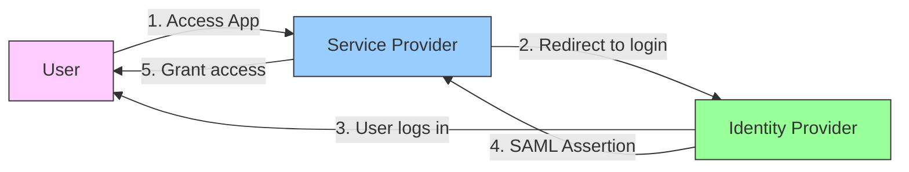
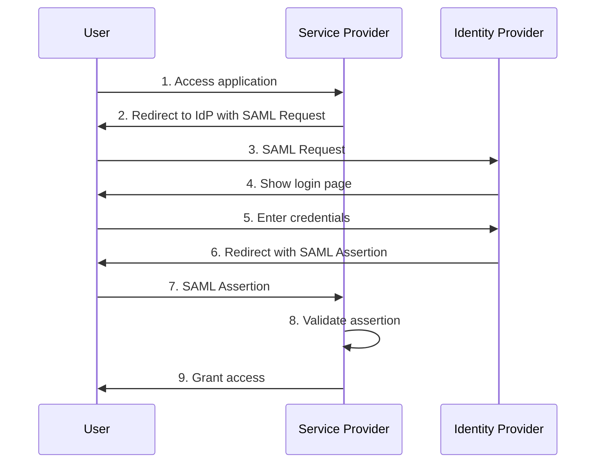
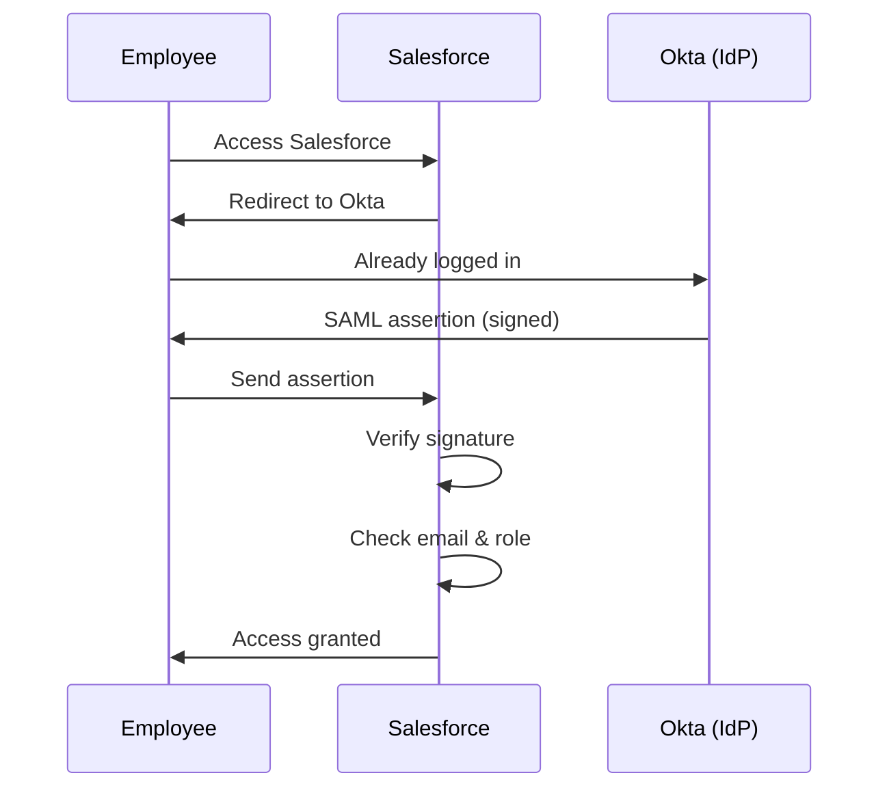

# SAML

Security Assertion Markup Language (SAML) is an XML-based standard for exchanging authentication and authorization data between an Identity Provider and a Service Provider.

## What is SAML?

SAML enables **Single Sign-On (SSO)** - log in once and access multiple applications without re-entering credentials.

**Real-World Example**: Log in to your company portal once, then access Gmail, Salesforce, and Slack without logging in again.

## Key Components

### 1. Identity Provider (IdP)

Service that authenticates users and provides identity information.

**Example**: Okta, Azure AD, Google Workspace, OneLogin

**What IdP Does**:

- Stores user credentials
- Authenticates users
- Issues SAML assertions
- Manages user profiles

### 2. Service Provider (SP)

The application that users want to access.

**Example**: Salesforce, Slack, AWS Console, Jira

**What SP Does**:

- Requests authentication
- Receives SAML assertions
- Grants access based on assertions
- Trusts the IdP

### 3. SAML Assertion

XML document containing authentication and authorization information about the user.

**Contains**:

- User identity (email, username)
- Authentication time
- Attributes (role, department, permissions)
- Digital signature for security

## SAML SSO Flow

### SP-Initiated Flow

User starts at the Service Provider (most common).

**Steps**:

1. User tries to access Salesforce
2. Salesforce redirects to company's IdP (like Okta)
3. User logs in at Okta
4. Okta creates SAML assertion
5. User's browser sends assertion to Salesforce
6. Salesforce validates assertion
7. User gets access to Salesforce

## SAML vs OAuth 2.0

| Aspect          | SAML                    | OAuth 2.0                  |
| --------------- | ----------------------- | -------------------------- |
| Primary Purpose | Authentication (SSO)    | Authorization (API access) |
| Format          | XML                     | JSON                       |
| Use Case        | Enterprise SSO          | Third-party app access     |
| Token Type      | SAML Assertion          | Access Token               |
| Complexity      | More complex            | Simpler                    |
| Mobile Support  | Limited                 | Better                     |
| Common In       | Enterprise environments | Consumer apps              |

**When to Use**:

- **SAML**: Enterprise SSO, employee access to internal apps
- **OAuth 2.0**: Third-party API access, "Sign in with Google"

## SAML Benefits

**Single Sign-On**:

- Log in once, access multiple apps
- Better user experience
- Reduced password fatigue

**Security**:

- Centralized authentication
- No password sharing between apps
- Digital signatures prevent tampering

**Management**:

- Central user management
- Easy to provision/deprovision users
- Audit trail of authentication

## SAML Challenges

**Complexity**:

- XML-based (verbose, complex)
- Difficult to debug
- Requires careful configuration

**Setup**:

- Trust relationship setup required
- Certificate management
- Attribute mapping configuration

**Mobile**:

- Not designed for mobile apps
- Better alternatives exist (OpenID Connect)

## Common SAML Providers

**Identity Providers**:

- Okta
- Azure AD (Microsoft)
- Google Workspace
- OneLogin
- Auth0

**Service Providers** (Support SAML SSO):

- Salesforce
- AWS
- Slack
- Jira
- GitHub Enterprise

## Real-World Example

**Scenario**: Company employee accessing Salesforce

**What happens**:

1. Employee clicks Salesforce link
2. Salesforce redirects to company's Okta
3. Employee already logged into Okta (SSO)
4. Okta creates signed SAML assertion
5. Browser sends assertion to Salesforce
6. Salesforce verifies signature and grants access

**Benefits**: Employee didn't need to log in again!

## When to Use SAML

**Good For**:

- Enterprise SSO
- Employee access to multiple apps
- Centralized user management
- Compliance requirements (audit trails)

**Not Ideal For**:

- Mobile applications (use OpenID Connect)
- Modern consumer apps (use OAuth 2.0/OIDC)
- API authorization (use OAuth 2.0)
