# Zero Trust Security

Zero Trust is a security model that requires **verification for every access request**, regardless of origin or location. It eliminates the notion of a "trusted perimeter" and assumes that threats could be both external and internal.

## Why Zero Trust Security?

### The Problem with Traditional Perimeter Security

The traditional security model was built on a simple assumption: **"trust everything inside the network perimeter, distrust everything outside."** This worked well in the 1990s-2000s when organizations had:

- **Employees in physical offices** - Centralized location, controlled networks
- **Fixed IT infrastructure** - On-premise data centers, stable networks
- **Minimal remote work** - Exceptions, not the rule
- **Limited cloud adoption** - Mostly proprietary systems

### Modern Security Challenges

**Key Drivers for Zero Trust Adoption:**

| Challenge                 | Impact                                     | Zero Trust Solution                         |
| ------------------------- | ------------------------------------------ | ------------------------------------------- |
| **Cloud Migration**       | No traditional perimeter in cloud          | Verify every access regardless of location  |
| **Remote Work Explosion** | VPN bypasses, uncontrolled devices         | Device compliance + continuous verification |
| **Insider Threats**       | Compromised employees with internal access | Least privilege + behavior monitoring       |
| **Ransomware & APTs**     | Attackers already inside the network       | Micro-segmentation + real-time detection    |
| **Supply Chain Attacks**  | Trusted partners as attack vectors         | Verify all connections, no implicit trust   |
| **Regulatory Compliance** | GDPR, HIPAA, PCI-DSS requirements          | Comprehensive auditing & access control     |

### Historical Context

- **2010**: Forrester Research coined the term "Zero Trust"
- **2013**: Google implemented "BeyondCorp" internally - pioneering Zero Trust at scale
- **2017**: NIST started developing Zero Trust Architecture guidelines
- **2019**: COVID-19 pandemic accelerated remote work adoption, making Zero Trust critical
- **2023-Present**: Zero Trust is now industry standard for enterprises

### Real-World Example: The Problem

**Before Zero Trust:**

```
1. Employee logs in once (VPN login with password)
2. Employee gains access to entire corporate network
3. Employee's laptop gets compromised by malware
4. Attacker moves laterally to sensitive data
5. Breach detected 6+ months later
```

**With Zero Trust:**

```
1. Employee authenticates with MFA + device compliance check
2. Employee can access only specific resources they need
3. Employee's laptop gets compromised
4. System detects unusual behavior in real-time
5. Access is immediately revoked, breach contained
```

## Core Principles

### 1. Least Privilege

Grant users the **minimum access** required to perform their job functions.

**Benefits:**

- Reduces attack surface
- Limits damage from compromised accounts
- Enforces separation of duties

### 2. Micro Segmentation

Divide your infrastructure into smaller, isolated zones to contain breaches and limit lateral movement.

**Architecture:**


**Implementation:**

- Virtual Private Clouds (VPCs)
- Network Access Control Lists (NACLs)
- Security groups with strict ingress/egress rules
- API gateways between segments

### 3. Continuous Monitoring & Verification

Continuously authenticate and authorize all users and devices, regardless of network location.

**Key Activities:**

- Monitor user behavior for anomalies
- Verify device compliance (OS patches, antivirus status)
- Log all access attempts
- Implement real-time threat detection

### 4. Adaptive Authentication

Adjust authentication strength based on context and risk level.

**Risk Factors:**

- **Low Risk**: Same device, familiar location, normal time
  - Single-factor authentication (password)
- **Medium Risk**: New device, unfamiliar location
  - Two-factor authentication (2FA)
- **High Risk**: Impossible travel, blacklisted IP, suspicious behavior
  - Multi-factor authentication (MFA) + additional verification

## Zero Trust Architecture

```mermaid
graph TD
    Start(["User Request"])

    Step1["1. Identity Verification<br/>Who are you?<br/>───<br/>🔐 Multi-factor auth<br/>📱 Device enrollment<br/>🆔 Biometric checks"]

    Step2["2. Device Compliance<br/>Is your device secure?<br/>───<br/>🖥️ OS version<br/>🛡️ Antivirus status<br/>🔥 Firewall enabled"]

    Step3["3. Access Control Policy<br/>What can you access?<br/>───<br/>🔑 RBAC/ABAC evaluation<br/>📋 Resource permissions<br/>⚙️ Contextual rules"]

    Step4["4. Continuous Monitoring<br/>Are you still trusted?<br/>───<br/>📊 Behavior analytics<br/>🚨 Real-time detection<br/>✅ Session validation"]

    Decision{"All Checks<br/>Passed?"}

    Grant(["✅ Grant Access"])
    Deny(["❌ Deny Access"])

    Start --> Step1
    Step1 --> Step2
    Step2 --> Step3
    Step3 --> Step4
    Step4 --> Decision
    Decision -->|Yes| Grant
    Decision -->|No| Deny

    style Start fill:#90caf9
    style Step1 fill:#c8e6c9
    style Step2 fill:#fff9c4
    style Step3 fill:#ffccbc
    style Step4 fill:#f8bbd0
    style Grant fill:#81c784
    style Deny fill:#e57373
    style Decision fill:#fff176
```



## Implementation Best Practices

### 1. Identity & Access Management (IAM)

### 2. Encryption

- **In transit**: TLS/SSL for all communications
- **At rest**: Encrypt sensitive data in databases
- **End-to-end**: Encrypt data from user to server

### 3. Network Segmentation

- Isolate critical systems
- Implement API gateways
- Use VPNs for remote access

### 4. Logging & Auditing

## Zero Trust vs Traditional Perimeter Security

| Aspect             | Traditional                | Zero Trust                   |
| ------------------ | -------------------------- | ---------------------------- |
| **Trust Model**    | Trust inside perimeter     | Never trust, always verify   |
| **Access Control** | Network-based              | Identity & context-based     |
| **Verification**   | One-time authentication    | Continuous re-authentication |
| **Monitoring**     | Perimeter-focused          | End-to-end & internal        |
| **Scalability**    | Difficult with remote work | Cloud-native friendly        |
| **Complexity**     | Simple                     | Complex but more secure      |

## Common Zero Trust Solutions

- **Azure AD** (Microsoft) - Cloud-based identity provider
- **Okta** - IAM and adaptive authentication platform
- **Cloudflare Zero Trust** - Network security with device verification
- **Google BeyondCorp** - Zero Trust access model
- **HashiCorp Vault** - Secrets management and encryption
