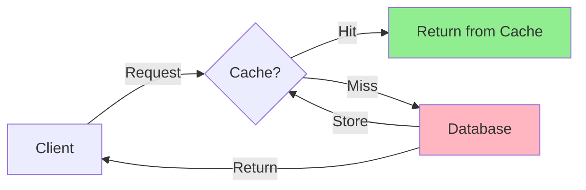
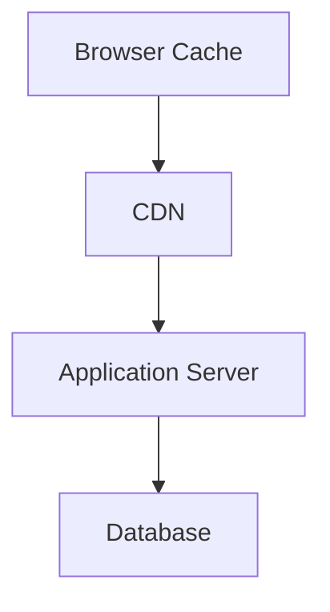
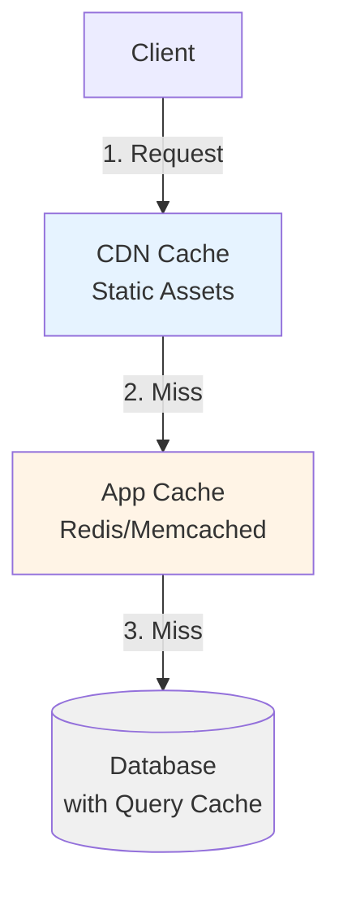
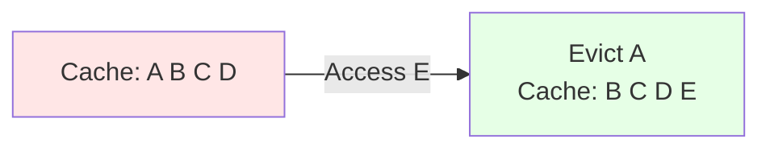
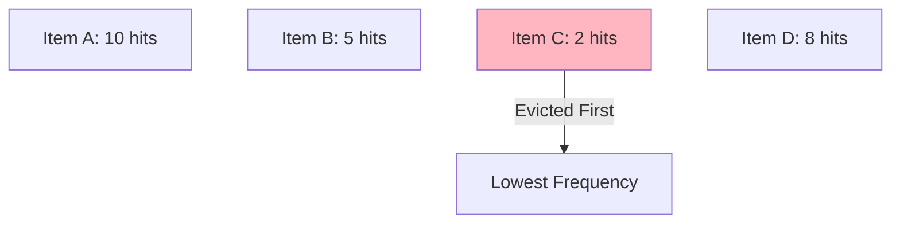
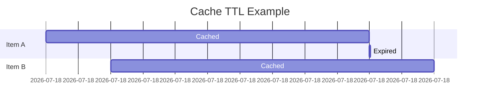
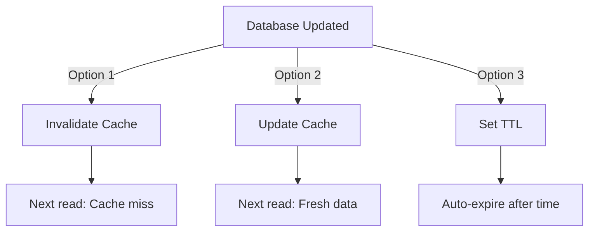
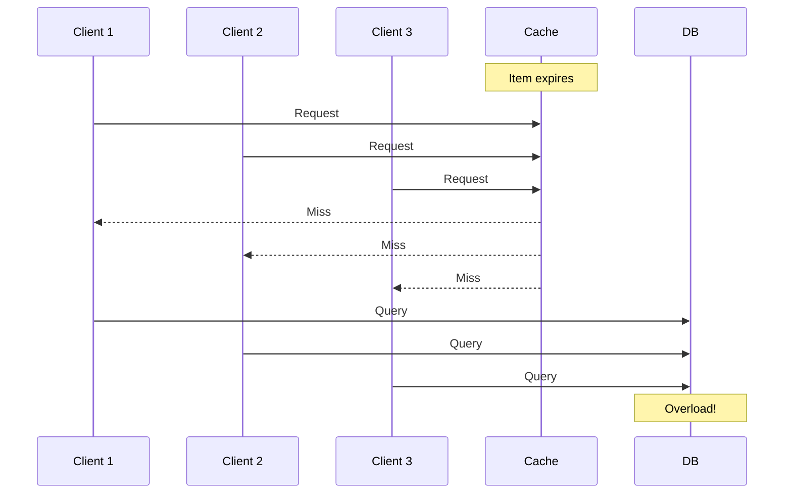

# Caching in Distributed Systems

## What is Caching?

Caching is a technique to store frequently accessed data in a fast-access layer (cache) to improve performance and reduce load on the primary data source.

### Key Benefits

1. **Reduce network calls** - Data served from nearby cache instead of remote servers
2. **Avoid repeated computations** - Store computation results for reuse
3. **Reduce database load** - Fewer queries to primary database

## Cache Placement Strategies

### 1. Client-Side Cache

Browser cache, mobile app cache

### 2. CDN Cache

Content Delivery Network for static assets

### 3. Application Cache

In-memory cache (Redis, Memcached)

### 4. Database Cache

Query result cache, buffer pools

## Cache Replacement Policies

When cache is full, these policies determine which data to evict.

### 1. LRU (Least Recently Used)

Evict the least recently accessed item.

**Use Case:** General-purpose caching

### 2. LFU (Least Frequently Used)

Evict the least frequently accessed item.

**Use Case:** When access patterns are consistent over time

### 3. FIFO (First In First Out)

Evict the oldest item in cache.

**Use Case:** Simple queuing scenarios

### 4. TTL (Time To Live)

Items expire after a fixed time period.

**Use Case:** Session data, temporary tokens

## Common Caching Use Cases

| Use Case         | Example                | Cache Type        |
| ---------------- | ---------------------- | ----------------- |
| Web Pages        | Product listings       | CDN, App Cache    |
| API Responses    | User profiles          | Redis/Memcached   |
| Session Data     | Login sessions         | In-memory cache   |
| Database Queries | Frequent reports       | Query cache       |
| Static Assets    | Images, CSS, JS        | CDN               |
| Computed Results | Analytics aggregations | Application cache |

## Caching Challenges

### 1. Cache Invalidation

Keeping cache synchronized with source data.

### 2. Cache Stampede

Multiple requests hit database when popular cache item expires.

**Solution:** Use cache locking or probabilistic early expiration

### 3. Cold Start Problem

Empty cache after restart leads to database overload.

### 4. Cache Consistency

Ensuring cache reflects latest data across distributed systems.

## Best Practices

1. **Set appropriate TTL** - Balance freshness vs performance
2. **Monitor cache hit ratio** - Target >80% for efficiency
3. **Use cache-aside pattern** - Application manages cache logic
4. **Implement graceful degradation** - System works if cache fails
5. **Cache immutable data** - Reduces invalidation complexity
6. **Use versioned keys** - Easier cache invalidation (`user:123:v2`)

---

📌 **Author:** Venkata Rajesh Jakka
📅 **Date:** 2025-11-22
