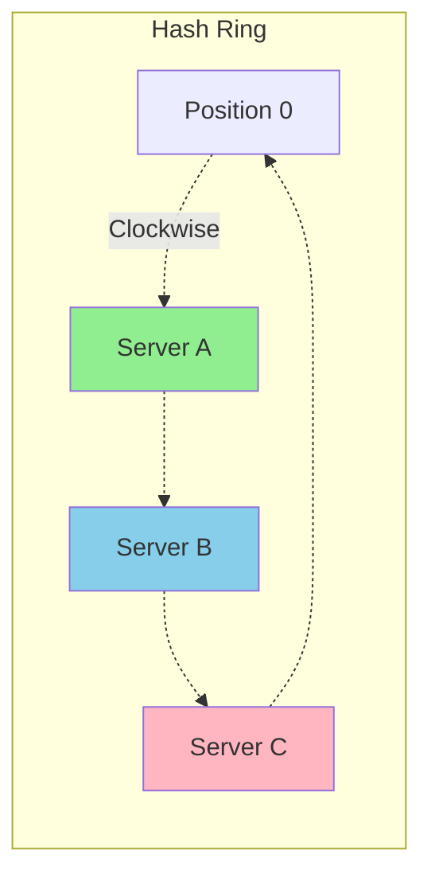
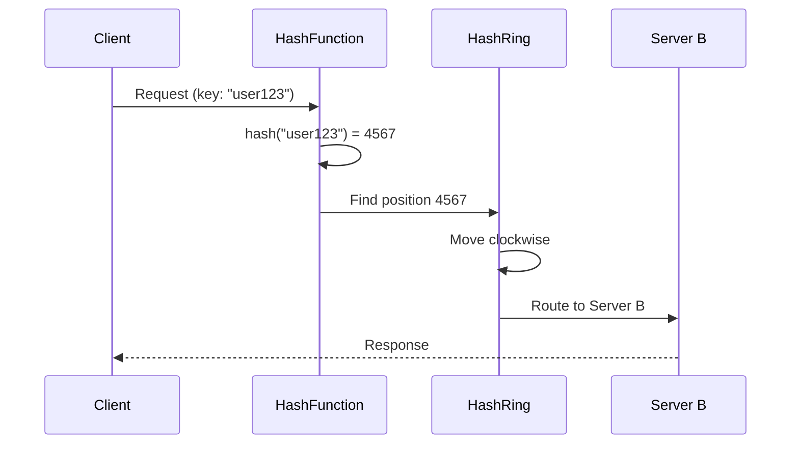
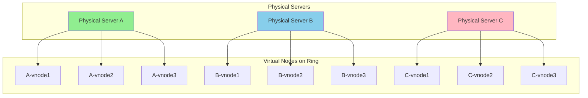

# Consistent Hashing

## What Problem Does It Solve?

When you have multiple cache servers or databases and need to distribute data across them, traditional hashing has a major problem: **when you add or remove a server, almost all keys need to be remapped**.

**Impact:**

- Most cache entries become invalid
- Massive cache misses
- Database gets overwhelmed
- Poor user experience

## How Consistent Hashing Solves This

Consistent hashing minimizes the number of keys that need to be remapped when servers are added or removed.

### The Hash Ring Concept

Imagine a circular ring with values from 0 to 2^32 (or any large number).

**How it works:**

1. **Hash servers:** Each server name is hashed to a position on the ring
   - `hash("Server A")` → Position on ring
   - `hash("Server B")` → Position on ring
   - `hash("Server C")` → Position on ring

2. **Hash keys:** Each key is hashed, then assigned to the next server clockwise
   - `hash("Key1")` → Find next server clockwise → Server A
   - `hash("Key2")` → Find next server clockwise → Server B

---

## Hashing Requests

### How It Works

**Steps:**
1. Hash the request key (user ID, session ID, URL, etc.)
2. Find position on ring
3. Move clockwise to find the first server
4. Route request to that server

---

## Virtual Nodes (Vnodes)

**Problem:** With few servers, one server might get most of the keys (uneven distribution).

**Solution:** Create multiple "virtual" positions for each physical server.

### Benefits of Virtual Nodes

**1. Even Distribution**
- Keys spread more uniformly across servers
- Reduces hotspots

**2. Smooth Scaling**
- When adding a server, load is redistributed gradually
- Multiple small chunks move, not one large chunk

**3. Flexibility**
- More powerful servers can have more virtual nodes
- Example: Server A (16 vnodes), Server B (8 vnodes)
- This ensures load distribution matches server capacity

---

## Key Advantages

**Minimal Remapping:**
- Traditional hashing: Adding/removing 1 server requires remapping most keys
- Consistent hashing: Only affects keys between the new server and its predecessor (~1/n of keys)

**Use Cases:**
- Distributed caching (Redis, Memcached clusters)
- Distributed databases (Cassandra, DynamoDB)
- Load balancers
- CDN routing

📌 **Author:** Venkata Rajesh Jakka
📅 **Date:** 2025-11-20
