# Database Sharding

## What is Database Sharding?

Database sharding is a technique of splitting a large database into smaller, more manageable pieces called shards. Each shard is an independent database that contains a subset of the total data.


**Benefits:**

- Improved performance (smaller datasets = faster queries)
- Horizontal scalability (add more shards as data grows)
- High availability (one shard down doesn't affect others)
- Reduced cost (use commodity hardware)

---

## Horizontal Partitioning (Sharding)

Splitting database rows across multiple servers. Each server contains same schema but different rows.


---

## Sharding Strategies

### 1. Range-Based Sharding

Divide data by ranges of a key.

**Example:** User IDs 1-1M → Shard 1, 1M-2M → Shard 2

**Pros:**

- Simple to implement
- Easy to add new shards
- Good for range queries

**Cons:**

- Uneven distribution if data not uniformly distributed
- Hotspots (newer users might all go to last shard)

### 2. Hash-Based Sharding

Use hash function to determine shard.

**Formula:** `shard = hash(user_id) % number_of_shards`


**Pros:**

- Even distribution across shards
- No hotspots
- Simple algorithm

**Cons:**

- Hard to add/remove shards (requires rehashing all data)
- Use consistent hashing to mitigate

### 3. Geographic Sharding

Split by location.

**Example:** US users → US shard, EU users → EU shard

**Pros:**

- Low latency (data near users)
- Data locality/compliance (GDPR)
- Natural partitioning

**Cons:**

- Uneven load if regions differ in size
- Cross-region queries expensive

### 4. Directory-Based Sharding

Lookup table maps keys to shards.

**Pros:**

- Flexible routing logic
- Easy to rebalance (just update directory)
- Can combine strategies

**Cons:**

- Directory lookup adds latency
- Directory becomes single point of failure
- Directory table can grow large

---

## Challenges & Considerations

### 1. Data Consistency

**Challenge:** Distributed transactions across shards are complex.

```mermaid
sequenceDiagram
    participant App
    participant S1 as Shard 1
    participant S2 as Shard 2

    App->>S1: Transfer $100 from User A
    S1-->>App: Success ✓
    App->>S2: Add $100 to User B
    S2--xApp: Fail ✗

    Note over App,S2: Inconsistent state!
```



**Solutions:**

- Avoid cross-shard transactions
- Use eventual consistency
- Implement 2-phase commit or Saga pattern

### 2. Availability

**Trade-off:** CAP theorem - can't have perfect consistency and availability during partition.

**Approach:** Replicate each shard for high availability.


### 3. Cross-Shard Queries

Queries spanning multiple shards are slow and complex.

**Example:** "Find all orders from all users" requires querying all shards and merging results.

**Solutions:**

- Denormalize data to avoid joins
- Use caching for common queries
- Pre-aggregate data
- Accept eventual consistency

### 4. Rebalancing

Adding/removing shards requires data migration.

**Challenges:**

- Downtime during migration
- Data transfer time
- Maintaining consistency

---

## Master-Slave Architecture

Database replication pattern where one server (master) handles writes and multiple servers (slaves) handle reads.


### How It Works

1. **Write:** All write operations (INSERT, UPDATE, DELETE) go to master
2. **Replicate:** Master copies data to slaves asynchronously or synchronously
3. **Read:** Read operations distributed across slaves

### Benefits

- **Read Scalability:** Add more slaves to handle read traffic
- **High Availability:** If master fails, promote a slave
- **Backup:** Slaves serve as live backups
- **Reduced Load:** Master handles fewer queries

---

## Vertical Partitioning

Splitting table by columns instead of rows. Different columns stored on different servers.

### How It Works

```
Users Table:
┌────┬──────┬───────┬────────┬─────────┐
│ ID │ Name │ Email │ Avatar │ Bio     │
└────┴──────┴───────┴────────┴─────────┘

Split into:

Server 1 (Frequently Accessed):
┌────┬──────┬───────┐
│ ID │ Name │ Email │
└────┴──────┴───────┘

Server 2 (Less Frequently):
┌────┬────────┬─────────┐
│ ID │ Avatar │ Bio     │
└────┴────────┴─────────┘
```

### Benefits

- **Performance:** Keep frequently accessed columns together
- **Reduced I/O:** Fetch only needed columns
- **Security:** Sensitive data on separate server with stricter access
- **Specialized Storage:** Text data on one server, binary data on another

### Use Cases

**1. Separate Hot and Cold Data**

Frequently accessed vs rarely accessed columns.

**2. Security Isolation**

Store sensitive data (SSN, credit cards) separately with encryption.

**3. Optimize Storage**

Store large BLOBs (images, videos) on different storage optimized for files.

### Drawbacks

- **Join Complexity:** Joining split tables requires cross-server queries
- **Limited Scalability:** Doesn't help with large number of rows
- **More Complex Queries:** Application needs to fetch from multiple locations

---

## Horizontal vs Vertical Partitioning

| Aspect          | Horizontal (Sharding)   | Vertical                |
| --------------- | ----------------------- | ----------------------- |
| **Splits**      | Rows                    | Columns                 |
| **Use Case**    | Too many rows           | Too many columns        |
| **Scalability** | High (add more shards)  | Limited                 |
| **Complexity**  | High                    | Medium                  |
| **Queries**     | Same columns, less rows | Less columns, all rows  |
| **Example**     | Split users by ID       | Split user profile data |

---

## Real-World Examples

**Instagram:** Shards user data by user ID using hash-based sharding

**YouTube:** Geographic sharding for video storage (content closer to users)

**Shopify:** Shards merchant data (each shop in separate shard)

**Discord:** Shards by guild (server) ID, master-slave for read replicas

**Amazon:** Vertical partitioning for product catalog (basic info vs detailed specs)

📌 **Author:** Venkata Rajesh Jakka
📅 **Date:** 2025-11-22
