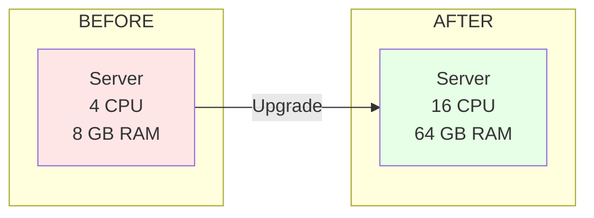
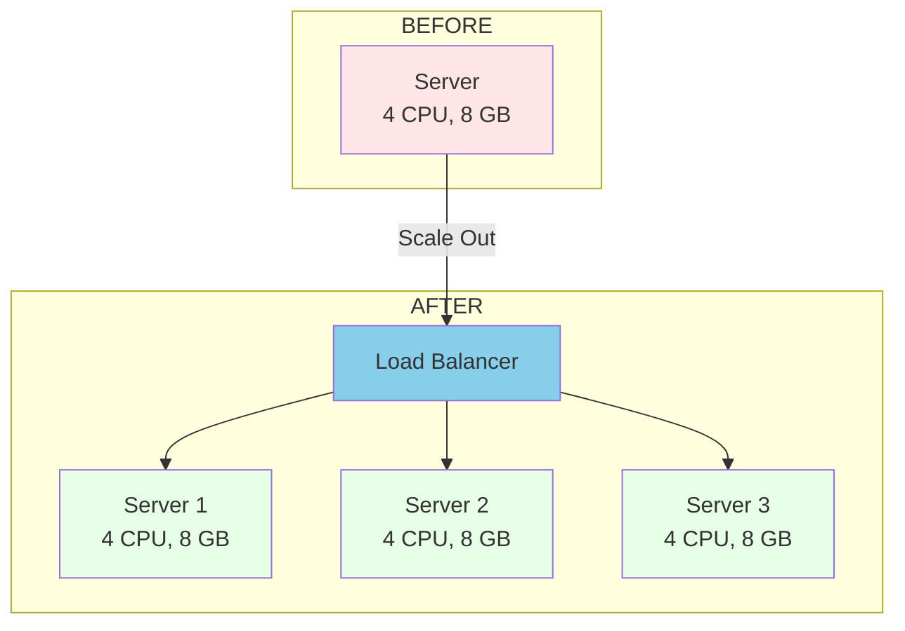
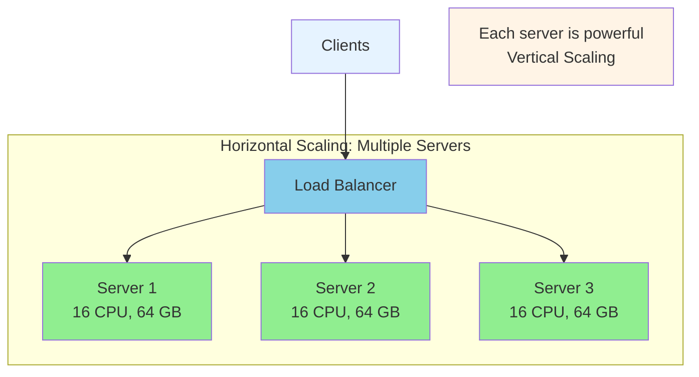

# Horizontal vs Vertical Scaling

## What is Scalability?

Scalability is the ability of a system to handle more load by adding resources. Two primary approaches: **Vertical Scaling** (scaling up) and **Horizontal Scaling** (scaling out).

---

## Vertical Scaling (Scaling Up)

Adding more resources (CPU, RAM, storage) to a single server.

### Key Characteristics

1. **No load balancing needed** - Single server handles all requests
2. **Single point of failure** - If server fails, entire application goes down
3. **Fast communication** - Components talk within same machine (inter-process)
4. **Data consistency** - All data on one machine, no sync issues
5. **Hardware limit** - Can't scale beyond physical server capacity

### Pros & Cons

**Pros:**
- Simple to implement
- Fast internal communication
- Easy data consistency
- Lower complexity

**Cons:**
- Limited scalability
- Single point of failure
- Downtime for upgrades
- Expensive at scale

---

## Horizontal Scaling (Scaling Out)

Adding more servers to distribute the load across multiple machines.

### Key Characteristics

1. **Needs load balancing** - Distributes requests across servers (Nginx, HAProxy, AWS ELB)
2. **Highly available** - If one server fails, others continue working
3. **Network calls** - Servers communicate over network (REST, gRPC, RPC)
4. **Data consistency challenges** - Data distributed across databases, sync needed
5. **Unlimited scaling** - Add/remove servers based on demand

### Pros & Cons

**Pros:**
- Nearly unlimited scalability
- High availability
- No single point of failure
- Auto-scaling with cloud
- Cost-effective at scale

**Cons:**
- More complex architecture
- Data consistency challenges
- Higher network latency
- Harder to debug
- Requires distributed systems expertise

---

## Comparison at a Glance

| Aspect               | Vertical Scaling      | Horizontal Scaling         |
| -------------------- | --------------------- | -------------------------- |
| **Approach**         | Upgrade single server | Add more servers           |
| **Cost**             | Expensive at high-end | Cost-effective with growth |
| **Limit**            | Hardware ceiling      | Virtually unlimited        |
| **Complexity**       | Simple                | Complex                    |
| **Load Balancing**   | Not required          | Required                   |
| **Failure Impact**   | Complete outage       | Partial degradation        |
| **Data Consistency** | Easy                  | Challenging                |
| **Communication**    | Inter-process (fast)  | Network calls (slower)     |
| **Downtime**         | Required for upgrades | Zero-downtime possible     |
| **Use Case**         | Small to medium apps  | Large-scale applications   |

---

## When to Use Each Approach

### Vertical Scaling (Use When)

- Small to medium applications
- Monolithic applications
- Legacy systems
- Data consistency is critical
- Early stage products

**Examples:** Databases (PostgreSQL, MySQL), internal tools, dev/test environments

### Horizontal Scaling (Use When)

- Large-scale applications (millions of users)
- Variable traffic patterns
- High availability needed (99.99% uptime)
- Microservices architecture
- Global applications

**Examples:** Social media, e-commerce, streaming services (Netflix, YouTube), SaaS platforms

### Hybrid Approach (Best Practice)

Most modern systems combine both approaches:

**Strategy:**

1. Start with vertical scaling (simpler)
2. Add horizontal scaling as you grow
3. Balance cost, complexity, and performance

📌 **Author:** Venkata Rajesh Jakka
📅 **Date:** 2025-11-16
