# Load Balancing

## What is Load Balancing?

Load balancing distributes incoming network traffic across multiple servers to ensure no single server becomes overwhelmed. It improves application availability, reliability, and performance.


**Benefits:**
- Prevents server overload
- Increases availability (no single point of failure)
- Enables horizontal scaling
- Improves response time

---

## Load Balancing Algorithms

### 1. Round Robin

Distributes requests sequentially to each server in rotation.

```
Request 1 → Server 1
Request 2 → Server 2
Request 3 → Server 3
Request 4 → Server 1  (back to first)
Request 5 → Server 2
```

**Pros:** Simple, fair distribution, no server state needed
**Cons:** Doesn't consider server load, assumes equal capacity
**Use When:** All servers have similar capacity

### 2. Weighted Round Robin

Similar to Round Robin but assigns different weights based on server capacity.

```
Server 1 (weight: 3) gets 3 requests
Server 2 (weight: 2) gets 2 requests
Server 3 (weight: 1) gets 1 request
```

**Use When:** Servers have different capacities (different CPU/RAM)

### 3. Least Connections

Routes requests to the server with the fewest active connections.

**Pros:** Better for long-lived connections, adapts dynamically
**Cons:** More complex, requires tracking connection state
**Use When:** Requests have variable processing times

### 4. Least Response Time

Routes to server with lowest response time and fewest connections.

**Use When:** Performance is critical

### 5. IP Hash

Uses client IP address to determine which server receives the request.

**Formula:** `hash(Client IP) % number_of_servers = Server Index`

**Pros:** Same client always goes to same server (session persistence)
**Cons:** Uneven distribution if clients behind NAT
**Use When:** Session persistence needed

---

## Consistent Hashing

Minimizes remapping when servers are added or removed.

**Traditional Hashing Problem:**
- 3 servers → add 1 server
- Most keys need to be remapped

**Consistent Hashing:**
- Only 1/n keys remapped when adding/removing server
- Better cache hit rates
- Used by Redis, Memcached clusters

---

## Sticky Sessions (Session Affinity)

Ensures requests from the same client always go to the same server during a session.


**Implementation Methods:**
1. **Cookie-Based:** Load balancer sets cookie with server ID
2. **IP Hash:** Same client IP → Same server

**Pros:** Preserves session state, simpler than distributed sessions
**Cons:** Uneven load distribution, sessions lost if server fails

---

## Load Balancer Types

### Layer 4 (Transport Layer)

Routes based on IP and TCP/UDP port.

**Characteristics:**
- Fast (no packet inspection)
- Works with any protocol
- Can't route based on content

**Examples:** AWS NLB, HAProxy (L4 mode)

### Layer 7 (Application Layer)

Routes based on HTTP headers, URL, cookies, etc.


**Capabilities:**
- Intelligent routing (URL, headers, cookies)
- SSL termination
- Caching, compression

**Characteristics:**
- Content-aware routing
- Slower than L4
- HTTP/HTTPS only

**Examples:** Nginx, HAProxy (L7 mode), AWS ALB

---

## Health Checks

Load balancers monitor server health and remove unhealthy servers from rotation.

```mermaid
sequenceDiagram
    participant LB as Load Balancer
    participant S1 as Server 1 ✓
    participant S2 as Server 2 ✗
    participant S3 as Server 3 ✓

    loop Every 10 seconds
        LB->>S1: Health Check
        S1-->>LB: 200 OK ✓

        LB->>S2: Health Check
        S2-->>LB: Timeout ✗

        LB->>S3: Health Check
        S3-->>LB: 200 OK ✓
    end

    Note over LB,S2: Server 2 removed from pool

    LB->>S1: Route traffic
    LB->>S3: Route traffic
```



**Check Types:**
- **Ping:** Simple connectivity check
- **TCP:** Can connect to port
- **HTTP:** GET request returns 200 OK
- **Custom:** Application-specific health endpoint (/health)

**Parameters:**
- **Interval:** How often to check (e.g., 10s)
- **Timeout:** How long to wait (e.g., 5s)
- **Threshold:** Failures before marking unhealthy (e.g., 3 consecutive)

---

## Comparison

### Performance Comparison

| Feature           | Layer 4      | Layer 7        |
|-------------------|--------------|----------------|
| **Speed**         | Very Fast    | Moderate       |
| **Routing**       | IP:Port only | Content-aware  |
| **SSL**           | Pass-through | Termination    |
| **Protocols**     | Any TCP/UDP  | HTTP/HTTPS     |
| **Cost**          | Lower        | Higher         |
| **Use Case**      | Raw traffic  | Web apps/APIs  |

---

## Real-World Example


**Architecture:**
1. DNS routes to nearest region
2. CDN caches static content
3. Layer 7 LB routes by URL path
4. Health checks ensure availability

📌 **Author:** Venkata Rajesh Jakka
📅 **Date:** 2025-11-20
