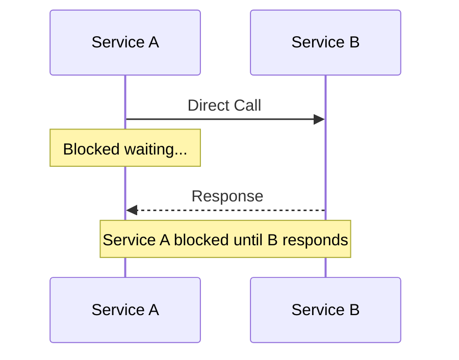
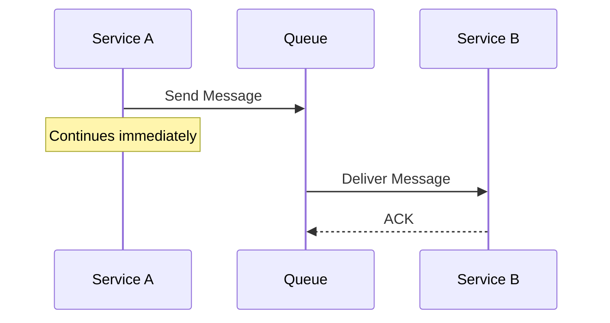
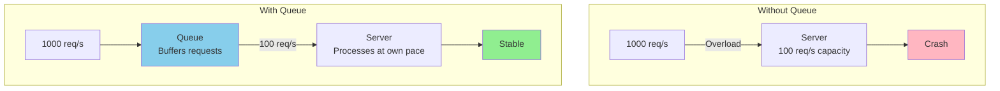
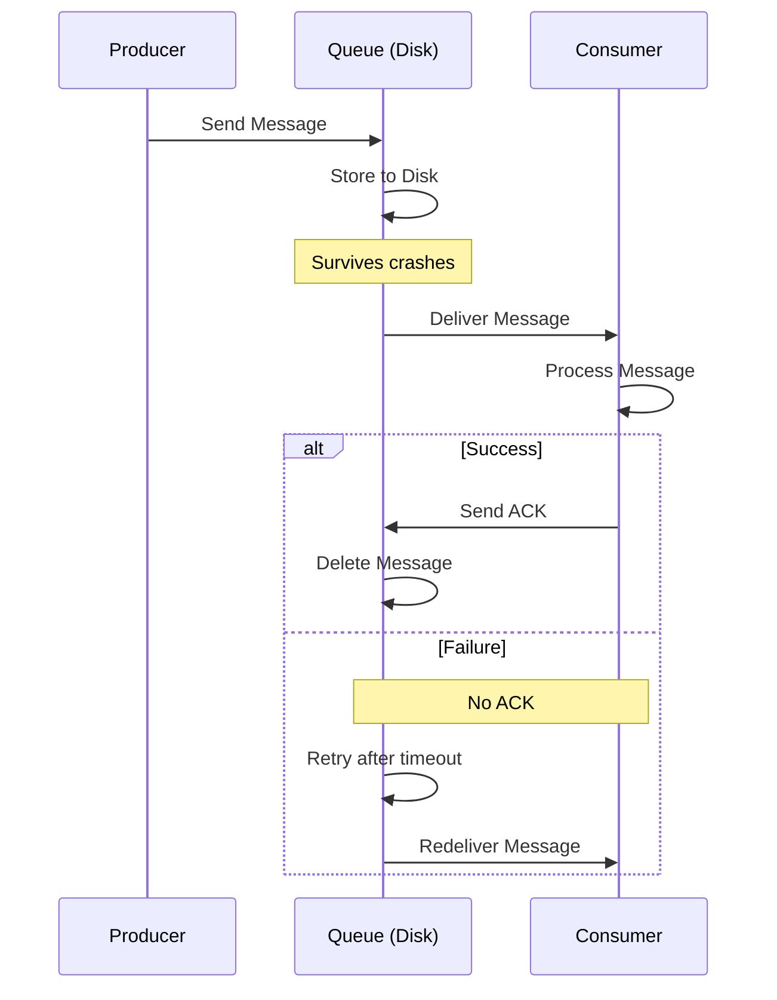
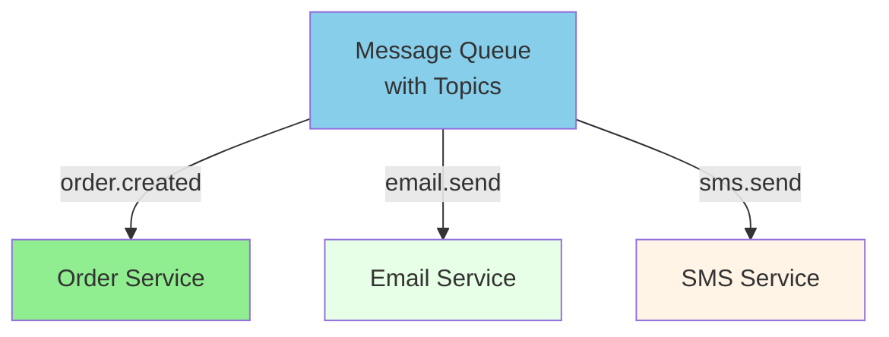
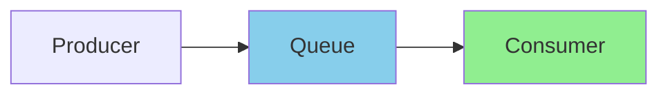
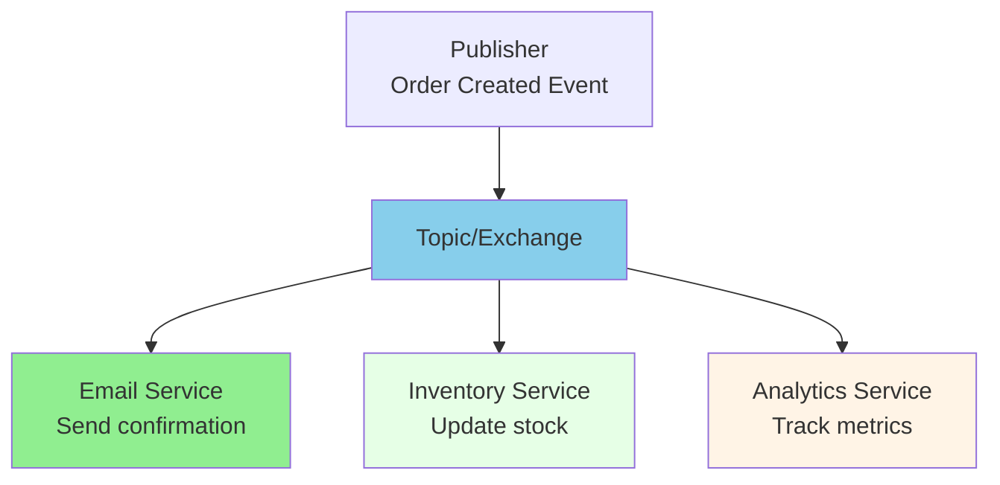
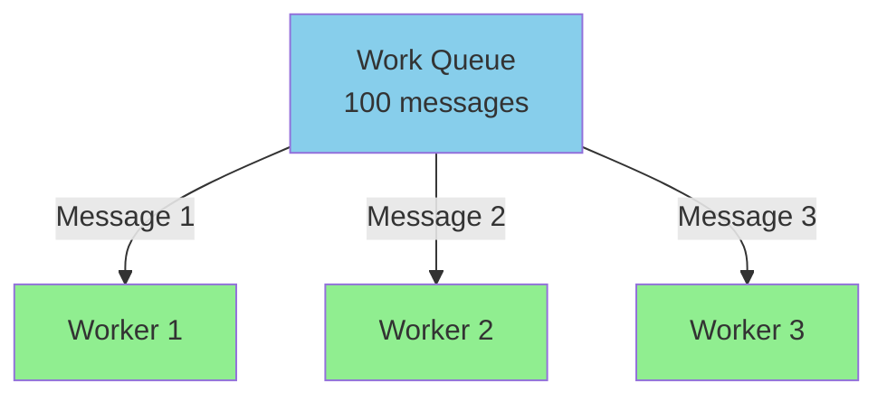
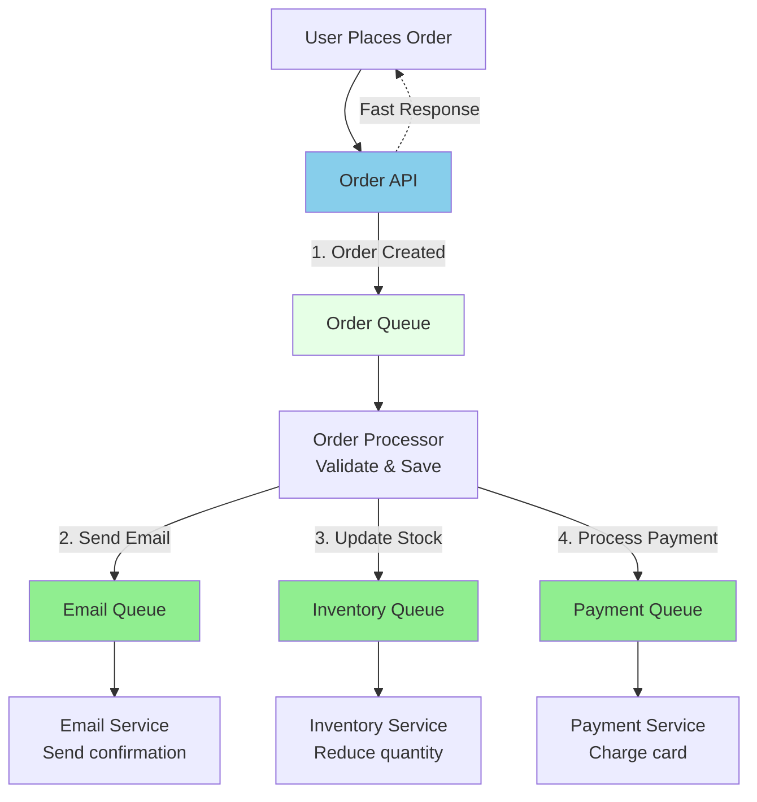

# Message Queue

## What is a Message Queue?

A message queue is a communication method used in distributed systems where messages are sent between services asynchronously. Instead of direct communication, services send messages to a queue where they wait to be processed.

### Without Message Queue (Synchronous)



**Problem:** Service A must wait for Service B to respond (blocking)

### With Message Queue (Asynchronous)



**Benefit:** Service A continues immediately without waiting

---

## Benefits of Asynchronous Processing

### 1. Decoupling Services

Services don't need to know about each other or be online at the same time.

**Example:** Service A sends to queue, Service B processes when ready. If Service B fails, Service A is unaffected.

### 2. Better Performance

Producer doesn't wait for consumer to process the message.

**Example:**

- Synchronous: User waits 3 seconds for processing → Slow
- Asynchronous: User gets response in 0.01 seconds → Fast (processing happens in background)

### 3. Load Leveling

Handle traffic spikes by queuing requests instead of overwhelming servers.



### 4. Scalability

Easy to add more consumers to process messages faster.

**Example:** 1 worker processes 100 messages/min. Add 2 more workers = 300 messages/min (3x throughput).

---

## Fault Tolerance

### Message Persistence & Acknowledgment



**How it works:**

1. Producer sends message to queue
2. Queue stores to disk (survives crashes)
3. Consumer processes message
4. If successful → sends ACK → message deleted
5. If failed → queue retries delivery

### Retry Mechanism & Dead Letter Queue

**Process:**

1. Consumer attempts to process message
2. If successful → Send ACK → Message deleted
3. If failed → Retry (typically 3 times)
4. Still fails → Move to Dead Letter Queue (DLQ) for manual investigation

---

## Message Queue Features

### 1. FIFO (First In, First Out)

Messages processed in the order they arrive.

```
┌─────────────────────────┐
│ Msg1 → Msg2 → Msg3 → Msg4│
└─────────────────────────┘
  ▲                      │
  │ New messages         │ Processed first
  │ added here           ▼
```

### 2. Message Priority

High-priority messages processed first.

```
Priority Queue:
┌────────────┐
│High: A, C  │ ←── Process first
│Med:  B     │
│Low:  D     │
└────────────┘
```

### 3. Message Filtering (Pub/Sub Topics)

Consumers subscribe to specific message types.



### 4. Message Batching

Process multiple messages at once for efficiency.

```
One at a time:        Batching:
Msg 1 → 0.1s         Batch [1,2,3,4,5] → 0.3s
Msg 2 → 0.1s
Msg 3 → 0.1s         Total: 0.3s ✓
... 5 times = 0.5s   vs 0.5s
```

### 5. Message Expiration (TTL)

Messages expire if not processed within time limit.

**Example:** "Flash sale - 1 hour only" with TTL: 3600 seconds

### 6. Delayed Messages

Messages delivered after a delay.

**Use case:** Reminder emails (send after 5 minutes delay)

---

## Message Queue Patterns

### 1. Point-to-Point

One message → One consumer



**Each message consumed once**

### 2. Pub/Sub (Publish-Subscribe)

One message → Multiple consumers



**All consumers receive copy of message**

### 3. Work Queue (Competing Consumers)

Multiple workers compete for messages.



**Load distributed across workers**

### 4. Request-Reply

Asynchronous request with response.

**Flow:**

1. Requestor sends request to request queue (with reply-to address)
2. Worker receives and processes
3. Worker sends response to reply queue
4. Requestor receives response

---

## Popular Message Queue Systems

| Feature         | RabbitMQ        | Apache Kafka    | AWS SQS        | Redis         |
| --------------- | --------------- | --------------- | -------------- | ------------- |
| **Type**        | Traditional     | Event Stream    | Cloud          | Cache + Queue |
| **Speed**       | Fast            | Very Fast       | Fast           | Very Fast     |
| **Persistence** | Yes             | Yes             | Yes            | Optional      |
| **Ordering**    | FIFO            | Yes             | FIFO option    | Lists         |
| **Complexity**  | Medium          | High            | Low            | Low           |
| **Best For**    | General purpose | High throughput | AWS ecosystems | Simple queues |

---

## Real-World Use Case: E-commerce Order Processing



**Flow:**

1. User places order → API responds immediately (fast UX)
2. Order added to queue for processing
3. Order processor validates and saves order
4. Triggers separate queues for email, inventory, payment
5. Each service processes independently
6. System resilient to failures in any service

📌 **Author:** Venkata Rajesh Jakka
📅 **Date:** 2025-11-20
