# Microservice Architecture

## What are Microservices?

Microservices are an architectural approach where an application is built as a collection of small, independent services that communicate over well-defined APIs. Each service is self-contained and focuses on a specific business capability.

---

## Monolith vs Microservices

### Monolithic Architecture

Single unified codebase where all components are tightly integrated.

**Characteristics:** One deployment, one codebase, tightly coupled

### Microservices Architecture

Application split into independent services.

**Characteristics:** Multiple deployments, independent codebases, loosely coupled

### Comparison

| Aspect             | Monolith         | Microservices             |
| ------------------ | ---------------- | ------------------------- |
| **Structure**      | Single unit      | Multiple services         |
| **Database**       | Shared           | Per service               |
| **Deployment**     | All at once      | Independent               |
| **Scaling**        | Scale entire app | Scale individual services |
| **Technology**     | One stack        | Multiple stacks           |
| **Development**    | Simple initially | Complex from start        |
| **Team**           | Centralized      | Distributed               |
| **Failure Impact** | Entire app down  | Service isolated          |

---

## Microservices Benefits

### 1. Independent Deployment

Services can be deployed separately without affecting others.

```mermaid
sequenceDiagram
    participant Dev as Developer
    participant PS as Payment Service
    participant US as User Service
    participant OS as Order Service

    Dev->>PS: Deploy v2.0
    Note over PS: Updated ✓
    Note over US,OS: No impact<br/>Still running
```

### 2. Technology Flexibility

Each service can use different technology stack.

**Example:**

- User Service: Node.js + MongoDB
- Order Service: Java + PostgreSQL
- Payment Service: Python + MySQL
- Notification Service: Go + Redis

### 3. Scalability

Scale only the services that need it.

**Example:** During Black Friday, scale Order Service 5x, Payment Service 2x, while User Service stays at 1x.

### 4. Fault Isolation

One service failure doesn't bring down the entire system.

**Result:** Payment down, but users can still browse and view orders (partial functionality).

---

## Microservices Challenges

### 1. Distributed Complexity

Network failures, service discovery, multiple points of failure

### 2. Data Consistency

Distributed transactions are difficult to manage.

**Solution:** Use Saga pattern or distributed transactions

### 3. Network Latency

Service-to-service calls over network (50ms) vs in-memory calls (0.001ms)

### 4. Deployment Complexity

Requires Kubernetes, CI/CD pipelines, monitoring tools

### 5. Testing Difficulty

Integration and end-to-end testing across services is complex

---

## Key Concepts

### 1. API Gateway

Single entry point for all client requests.

### 2. Service Discovery

Services find each other dynamically using tools like Consul or Eureka.

### 3. Communication Patterns

**Synchronous:** Service A calls Service B via REST/gRPC and waits for response (fast but coupled)

**Asynchronous:** Service A publishes event to Message Queue, Service B/C/D consume when ready (slower but decoupled)

### 4. Database Per Service

Each service owns its database for loose coupling, independent scaling, and technology freedom.

### 5. Event-Driven Architecture

Services communicate through events.

### 6. Circuit Breaker

Prevent cascading failures by failing fast when a service is down.

**States:**

- **Closed:** Normal operation, requests pass through, monitor failures
- **Open:** Failures exceed threshold, fail fast, return fallback
- **Half-Open:** Test if service recovered with limited requests

---

## Design Patterns

### 1. Saga Pattern

Manage distributed transactions with compensation.

**Happy Path:** Create order → Charge payment → Reduce inventory → Success

**Failure Path:** Create order → Charge payment → Inventory fails → **Refund payment** → Cancel order

### 2. Strangler Fig Pattern

Gradually migrate from monolith to microservices.

**Phase 1:** All requests go to monolith
**Phase 2:** Route `/users` to User Service, other requests to monolith
**Phase 3:** All routes go to microservices, retire monolith

---

## When to Use Microservices

### Use Microservices When:

✅ Large teams working independently
✅ Complex domain needing different technologies
✅ High scalability needs
✅ Frequent deployments required
✅ Long-term project

**Examples:** Netflix, Amazon, Uber, Airbnb

### Avoid Microservices When:

❌ Small team (< 10 people)
❌ Simple application
❌ Startup/MVP stage
❌ Unclear requirements
❌ Limited DevOps skills

**Recommendation:** Start with monolith, extract services later when needed

---

## Real-World Example: E-commerce Platform

**Architecture:**

- **API Gateway**: Routes requests, handles authentication
- **Independent Services**: Each with own database & tech stack
- **Event-Driven**: Order events trigger payment, notification, inventory updates
- **Scalable**: Each service scales independently
- **Resilient**: Service failures don't cascade

📌 **Author:** Venkata Rajesh Jakka
📅 **Date:** 2025-11-22
